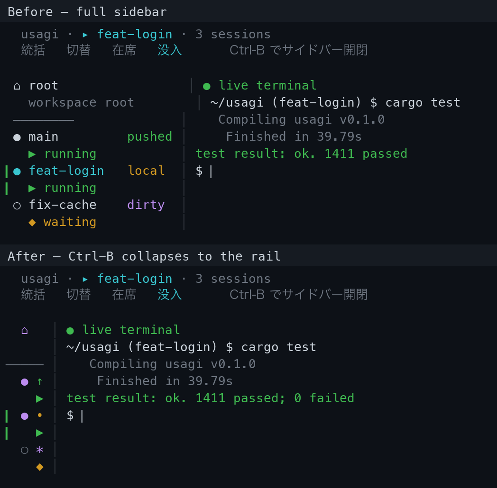

# 5. ホーム画面（Home）

> [画面設計トップ](README.md) ｜ ← 前へ [4. 設定画面（Config）](04-config.md)

プロジェクト選択画面でワークスペースを選ぶと遷移する、ワークスペース操作のメイン画面。
worktree 一覧（左ペイン・各エントリ 2 行）・右ペイン・コマンド入力欄（下部）の 3 ペイン構成で、
ユーザーが「いまどの立場で何を操作しているか」を **3 つのモード（切替・在席・没入）** で
切り替えながら操作します。下のモードほどワークスペース全体を俯瞰し、上のモードほど 1 つのセッションの
内側へ深く入り込む「**関与のはしご（engagement ladder）**」になっており、**切替へズームアウト**（在席・切替では `Ctrl-O`、没入では[キー方式](#没入のキー操作attached--terminal--agent-実行中)に従い既定では `Ctrl-O` リーダーの次に `o`）と
`Esc` の**一段戻る**で統一されています（ただし基底の**切替**では戻り先がないため `Esc` は無効）。
ワークスペース全体のコマンド（`session` / `config` など）は、`:`（コロン）で開く
**[コマンドパレット（統括 / Overview）](#コマンドパレット統括overview)**から実行します。
ホーム画面を閉じるのは切替・在席では `Ctrl+C` または `Ctrl+Q`、没入では[キー方式](#没入のキー操作attached--terminal--agent-実行中)に従い既定で `Ctrl-O q`（`alt` 方式なら `Alt-q`）で、いずれも[終了確認モーダル](#終了確認モーダル)を挟みます。worktree の情報はワークスペースの
`<workspace>/.usagi/state.json`（画面外で `usagi` が同期した内容）から読み込みます。起動画面と同じ
代替スクリーン上に描画されます。

> TUI 内コマンドの一覧・引数は [../03-commands/02-tui.md](../03-commands/02-tui.md) に集約しています。
> 本書は画面レイアウトとモード・キー操作に絞ります。

> ホーム画面の 3 モード（**切替・在席・没入**）は実際の状態であり、設計・実装・レビューの会話では
> この 3 語と状態遷移を使ってください。ワークスペース全体のコマンドを実行する**統括（Overview）**は
> 常駐モードではなく、`:` で開く**コマンドパレット**として上に重なります。詳細は
> [モードと状態遷移（切替・在席・没入）](#モードと状態遷移切替在席没入)。

## 目次

- [モードと状態遷移（切替・在席・没入）](#モードと状態遷移切替在席没入)
- [コマンドパレット（統括 / Overview）](#コマンドパレット統括overview)
- [レイアウト](#レイアウト)
- [更新通知（最新リリースの検知）](#更新通知最新リリースの検知)
- [バックグラウンドタスク（セッション作成・削除）](#バックグラウンドタスクセッション作成削除)
- [処理中の表示（ローディングうさぎ）](#処理中の表示ローディングうさぎ)
- [構成要素](#構成要素)
- [モードとキー操作](#モードとキー操作)
- [キーバインドのチートシート](#キーバインドのチートシート)
- [コマンドスコープ](#コマンドスコープ)
- [TUI 内コマンド](#tui-内コマンド)
- [終了確認モーダル](#終了確認モーダル)
- [セッション削除モーダル](#セッション削除モーダル)
- [セッションメモの編集](#セッションメモの編集)
- [履歴の永続化](#履歴の永続化)
- [読み込み失敗時の挙動](#読み込み失敗時の挙動)

## モードと状態遷移（切替・在席・没入）

ホーム画面は常に全セッションを左ペインに並べたまま、ユーザーの操作対象に応じて **3 つのモード** を
行き来します。下のモードほどワークスペース全体を俯瞰し、上のモードほど 1 つのセッションの内側へ
深く入り込みます。**切替へズームアウト**（在席は `Ctrl-O`、没入は[キー方式](#没入のキー操作attached--terminal--agent-実行中)に従い既定 `Ctrl-O o`）と `Esc` の**一段戻る**で統一されています
（基底の**切替**では戻り先がないため `Esc` は無効。終了は `Ctrl+C` / `Ctrl+Q`）。ワークスペース全体のコマンドは
モードではなく、`:` で開く[コマンドパレット（統括）](#コマンドパレット統括overview)から実行します。
**起動直後の既定モードは切替**です。

| モード | 名称（英） | 操作の対象 | キー入力の行き先 | 右ペイン |
|---|---|---|---|---|
| **切替**（Switch） | 既定モード。セッションの選択・タブの切替・新規作成・タブを閉じる（セッションピッカー） | **左ペイン**（一覧そのものにフォーカス。カーソル以外の行は淡色） | **選択後に開く画面のプレビュー**（ライブでないセッションは在席の[アクション UI](#在席のアクション-uimenu--prompt)を `session_action_ui` 設定どおり（Menu／Prompt）に、live は**タブストリップ＋実際のターミナル画面**。先頭に status・Agent 状態。操作キーはフッターにまとめる。キーボードは左ペインにあるため**プレビュー全体は淡色**で表示し、ここが選択対象でないことを示す（メモを開いているときだけ、その浮動ボックスは淡色の上に明色で重なる）） |
| **在席**（Focus） | 選択中の 1 セッションのコマンド（Session スコープ）／ライブなペインのタブ | **右ペイン**（タブ＋アクション UI） | ライブなペインがあれば**タブストリップ（ペインのタブ。「+ new」は選択中だけ末尾に表示）**、選択タブに応じて**ペインのプレビュー**か**アクション UI（メニュー／プロンプト）**。ライブなペインが無ければアクション UI のみ |
| **没入**（Attached） | セッションの中身（埋め込みシェル / Agent。1 セッションに複数ペインを持てる） | 埋め込みシェル / Agent | タブストリップ＋ライブの埋め込み端末 |

ワークスペース全体を操作する**統括（Overview）**はこの 3 段のラダーには現れず、`:` で開いて
中央オーバーレイ（モーダル）として上に重なる[コマンドパレット](#コマンドパレット統括overview)です。

### 状態遷移表

「切替へズームアウト」（在席・切替では `Ctrl-O`、没入は[キー方式](#没入のキー操作attached--terminal--agent-実行中)に従い既定 `Ctrl-O o`）と `Esc` =「一段戻る」（基底の切替では戻り先がないため `Esc` は無効。終了は切替・在席で `Ctrl+C` / `Ctrl+Q`、没入は既定 `Ctrl-O q`）。
`:` はどのモードからも（没入を除く）[コマンドパレット](#コマンドパレット統括overview)を開き、`Esc` で閉じて元のモードへ戻ります。

```text
起動 → 切替（Switch）         （既定。Esc 無効。Ctrl+C/Ctrl+Q で終了＝確認モーダル）
切替/在席 --`:`--> コマンドパレット（Esc で閉じて元のモードへ戻る。モード遷移コマンドは閉じてから遷移）
切替 --↑↓/jk--> セッション移動 ;  --K/J--> 選択中セッションを上下へ移動し手動順を永続化 ;  --s--> 入力待ち（◆）を先頭へ寄せる並び替えのオン/オフ（表示順のみ） ;  --←→/hl または Ctrl-N/Ctrl-P--> タブ切替（選択中セッションのアクティブタブを実切替） ;  --Enter--> ライブ? 没入 : 在席 ;  --t--> 在席（新規ペイン作成の起点） ;  --x--> 選択中セッションのアクティブタブ（ペイン）を閉じる ;  --c→インライン名入力→Enter--> 在席(新規) ;  --r→インライン表示名入力→Enter--> 表示名を変更 ;  --n または Ctrl-E→メモ編集→Ctrl-S--> メモを保存 ;  --Ctrl-^--> 直前のセッション ;  --Esc--> 無効（基底のため戻り先なし）
在席 --terminal/agent（「+ new」タブ）--> 没入（新規ペインを追加して入る） ;  --Ctrl-N/Ctrl-P--> タブ巡回（ライブなペインのタブ＋末尾の「+ new」タブ。ペインのタブはアクティブタブを実切替しプレビューが追従） ;  --Enter（ペインのタブ）--> 没入（そのペインへ再アタッチ） ;  --Ctrl-^--> 直前のセッション ;  --Esc（「+ new」タブ・ライブなペインあり）--> アクティブペインのタブへ戻る（破棄して 在席 に留まる） ;  --Esc（それ以外）--> 切替 ;  --Ctrl-O--> 切替
没入（既定の `prefix` 方式。リーダー `Ctrl-O` の次のキー。`alt` 方式では各操作が `Alt` 単打） --次/前タブ（Ctrl-O n/p ｜ Alt-→/←）--> タブ切替（没入のままアクティブペインを前後へ） ;  --在席へ（Ctrl-O a ｜ Alt-a）--> 在席の「+ new」タブへズームアウト（アクションメニューで terminal / agent などを選ぶ。全ペインは生かしたまま） ;  --agent タブ追加（Ctrl-O g ｜ Alt-g）--> 新しい agent タブを追加（没入のまま） ;  --Ctrl-^--> 直前のセッション（ライブなら再アタッチ。全ペインは生かしたまま） ;  --メモ編集（Ctrl-O e ｜ Alt-e）--> メモ編集（閉じると同じペインへ復帰） ;  --切替へ（Ctrl-O o ｜ Alt-o）--> 切替（全ペインは生かしたまま） ;  --シェル終了--> ペインを閉じる（他ペインが残れば没入継続、最後の 1 枚なら在席）
```

> 没入が予約するキーは[キー方式（`key_scheme`）](../05-settings.md#設定項目)で決まります。既定の **`prefix` 方式**ではリーダー `Ctrl-O` だけを奪い、操作は**その次のキー**で指定します — `Ctrl-O o`（切替へズームアウト）・`Ctrl-O a`（在席へズームアウトしアクションメニュー）・`Ctrl-O n`/`Ctrl-O p`（タブ前後。`Ctrl-O →`/`←` も）・`Ctrl-O g`（agent タブ追加）・`Ctrl-O e`（[メモ編集](#セッションメモの編集)）・`Ctrl-O s`（[サイドバー開閉](#サイドバーの開閉ctrl-b)）・`Ctrl-O q`（アプリ終了の[確認モーダル](#終了確認モーダル)）。`Ctrl-O Ctrl-O` でリーダー自体をシェルへ送れます。これにより `Ctrl-E`（行末）・`Ctrl-N`/`Ctrl-P`（履歴）・`Ctrl-T`・`Ctrl-G` などの bare Ctrl キーはシェル/エージェントへそのまま流れます。
> **`alt` 方式**では各操作が `Alt` 単打になり（`Alt-o`/`a`/`g`/`e`/`s`/`q`・`Alt-→`/`←`）、bare Ctrl キーを一切奪いません（macOS は端末の Option=Meta 設定が前提）。
> どちらの方式でも `Ctrl-^`（[直前のセッションへ切替](#直前のセッションへ切り替えctrl-)）は直キー、`Ctrl-C` は選択があるときコピー、`Esc` と `Ctrl-W`（直前の単語を削除）はシェルへ流します（タブを閉じるのは切替の `x`）。没入ではキーがシェルへ流れるため `:` のコマンドパレットは開けません（まず切替へズームアウトします）。
> タブの切替は切替・在席では `Ctrl-N`/`Ctrl-P`（切替は `←`/`→`・`h`/`l` も同じ）で行えます（在席のこれらはペインのタブ＋末尾の「+ new」タブを巡回。既存ペインのタブで `Enter` は再アタッチ、「+ new」タブはアクション UI）。terminal タブの追加は在席の「+ new」タブのアクションメニュー（没入では「在席へ」で開く）か切替の `t`、agent タブの追加は没入の agent-タブ追加キー・在席のメニュー・切替の `t` から行えます。詳細は [没入のキー操作](#没入のキー操作attached--terminal--agent-実行中)。

### 各モードの説明

- **切替（Switch）** — ワークスペースを開いた直後の既定モード。セッションを選ぶ／作る／タブを切り替えるためのピッカー。**キーボードは左ペイン**に移り（中央モーダルや
  オーバーレイは使いません）、`↑↓`/`k`/`j` で**セッション間**を移動、`←→`/`h`/`l`（または `Ctrl-N`/`Ctrl-P`）で
  **選択中セッションのタブ間**を移動します
  （アクティブタブを実際に切り替えるので、右ペインのプレビューも追従し、`Enter`/`Ctrl-O` で戻るとそのタブに入ります）。
  `Enter` で確定（確定先がライブなら**没入**へアタッチ、ライブでなければ**在席**へ）、`t` で選択中セッションの
  **在席のアクション UI**（設定どおり Menu／Prompt）を開いて**新しいペインを追加**します。`x` で**選択中セッションのアクティブタブ（ペイン）を閉じ**、そのシェルを終了します（次フレームでタブを読み直し、ペインが残ればそのタブを、最後の 1 枚を閉じたら在席のアクション UI をプレビューします）。
  操作キーは**フッターにだけ**まとめて表示し（`c new` / `r rename` を含む全キー）、右ペインはプレビューに専念させて重複を避けます。`c` で**左ペイン内のインライン名入力**を開いてセッションを新規作成します。名前は
  **入力中に逐次バリデーション**され、使えない名前(空文字・パス区切り・既存ブランチとの重複や名前空間の衝突)は
  入力欄の直下に赤字で理由を表示して `Enter` を弾きます(判定規則は
  [orchestration のセッション構築](../04-orchestration.md#セッションの構築再帰走査と複数リポジトリ対応) が正本)。`Enter` で作成 →在席、`Esc` で
  キャンセルです。`r` で**カーソル中セッションの表示名（サイドメニューのラベル）をインライン編集**できます
  （入力欄は現在のラベルが初期値。空にするとラベルを解除しセッション名に戻ります）。表示名は**サイドメニューの見た目だけ**を
  変え、ブランチ名・セッションの識別子は変えません（`session switch <name>` などは従来どおりセッション名で対象を指します）。
  `n`（または在席・没入と同じ `Ctrl-E`）で**カーソル中セッションのメモを編集**します（[セッションメモ](#セッションメモの編集)。右ペイン右上にエディタの枠付きボックスが重なり、複数行の覚え書きを書けます）。
  切替は関与のはしごの**基底**なので `Esc` は無効です（戻り先がない。終了は `Ctrl+C` / `Ctrl+Q`）。`:` で[コマンドパレット](#コマンドパレット統括overview)を開いてワークスペース全体のコマンドを実行できます。
- **在席（Focus）** — 1 つのセッションを選んだ状態で、そのセッションで実行できるコマンドを**右ペイン**で操作します
  （[コマンドスコープ](#コマンドスコープ)の Session：`terminal` / `agent` / `close`）。右ペインの UI は
  設定 `session_action_ui` で切り替えます（**Menu**＝選べるリスト／**Prompt**＝セッションスコープのコマンドライン。後述）。
  `terminal` / `agent` を実行すると**新しいペインを追加して没入**へ。ただし**1 セッションが持てる agent は 1 つだけ**で、すでに agent ペインがあるときに `agent` を実行すると新規追加せず**その agent タブへ移動**します（terminal は何枚でも追加できる）。`close` で在席中のセッションを削除し（`session remove` と同じで `--force` は付けないので、未コミット変更があれば削除を拒否し `--force` の案内をログに出す）、次のセッションを選べるよう**切替**へ移ります。`close` はセッションに属さない**ルート行（`⌂ root`）では出しません**（ワークスペース自体は閉じられないため）。アクション UI／切替プレビューに並ぶコマンドは**その行に対して実行できるものだけ**で、切替プレビューはカーソル行（選んだら開く行）を基準に並べます（アクティブ行ではなく）。
  **フォーカス中セッションがライブのペインを持つとき（没入から「在席へ」（既定 `Ctrl-O a`）でズームアウトした場合など）は、右ペインの上端に没入と同じ
  タブストリップが出ます**（`[1 agent] [2 terminal] …`）。「+ new」タブは**それが選択されているあいだだけ**末尾に現れる（`[1 agent] [2 terminal] … [+ new]`）ので、ペインのタブを選ぶと「+ new」チップは消えます。タブストリップの下に出る内容は**選択中のタブ**で決まる
  2 階層構造です — 既存ペインのタブを選ぶと**そのペインのライブ画面プレビュー**（スナップショット未着なら再アタッチ案内）を、「+ new」タブを選ぶと
  **アクション UI（Menu／Prompt）**を表示します。`Ctrl-T` でズームアウトした直後は末尾の「+ new」タブに着地し、すぐ `terminal` / `agent` を選んで新規ペインを追加できます。`Ctrl-N`/`Ctrl-P` で**ペインのタブと「+ new」タブを巡回**し（既存ペインのタブはアクティブタブを実切替するので
  プレビューが追従し、次の再アタッチ／`terminal`/`agent` もそのタブに入る）、既存ペインのタブで `Enter` を押すと**そのペインへ再アタッチ（没入）**します。
  ライブのペインが無いセッション（在席に入った直後など）はタブストリップを出さず、従来どおりアクション UI だけを表示します。
  `Esc` は 1 段ずつ戻ります — **ライブなペインを持つセッションの「+ new」タブ**では、その「+ new」を破棄して**アクティブペインのタブへ戻り**（在席に留まり、そのペインがプレビューされる）、それ以外（ペインのタブ上、またはライブなペインが無いセッション）では**切替**へ。`Ctrl-O` も**切替**へズームアウトします。`:` で[コマンドパレット](#コマンドパレット統括overview)を開けます。
- **没入（Attached）** — 埋め込みシェル / Agent が右ペインでライブ動作します。右ペインの上端には**タブストリップ**
  （ペインごとの番号付きチップ＋アクティブタブの下線、2 行）が出て、1 セッションの中に複数ペイン（agent と並行して
  terminal など）を持てます。**予約キーは[キー方式（`key_scheme`）](../05-settings.md#設定項目)で決まります**。既定の **`prefix` 方式**ではリーダー `Ctrl-O` の**次のキー**で操作します — `Ctrl-O o`（**切替**へズームアウト）・`Ctrl-O a`（**在席へズームアウトしてアクションメニュー**で terminal / agent などを選ぶ）・`Ctrl-O n`/`Ctrl-O p`（**没入のままアクティブタブを前後へ**切替。`Ctrl-O →`/`←` も）・`Ctrl-O g`（**agent タブへ移動**＝無ければ追加し、あればその 1 つへ。agent は 1 セッション 1 つ）・`Ctrl-O e`（**[メモ編集](#セッションメモの編集)**。閉じると同じペインへ復帰）・`Ctrl-O s`（**[サイドバーを開閉](#サイドバーの開閉ctrl-b)**）・`Ctrl-O q`（**アプリ終了の[確認モーダル](#終了確認モーダル)**）。`Ctrl-O Ctrl-O` でリーダー自体をシェルへ送れ、`Ctrl-O` 以外の bare Ctrl キー（`Ctrl-E` 行末・`Ctrl-N`/`Ctrl-P` 履歴など）はすべてシェル / Agent へ流れます。
  **`alt` 方式**にすると各操作が `Alt` 単打（`Alt-o`/`a`/`n`相当は `Alt-→`/`←`・`g`/`e`/`s`/`q`）になり、bare Ctrl キーを一切奪いません（macOS は端末の Option=Meta 設定が前提）。どちらの方式でも `Ctrl-^`（直前のセッション）は直キー、`Ctrl-C` は選択時コピー、`Esc` と `Ctrl-W`（直前の単語を削除）はシェルへ流れます。タブを閉じるのは切替（切替へ抜けて `x`）で行います。terminal タブの追加は在席のアクションメニュー（「在席へ」で開く）か切替（`t`）でも行えます。
  シェルが終了したとき、他のペインが残っていれば没入のまま、最後の 1 枚なら**在席**へ戻ります。切替へズームアウトしても
  セッションの全ペインは生かしたままで、再アタッチすると最後に居た（切替で選んだ）タブに戻ります。

> 没入は切替・在席のどちらからでも `terminal` / `agent`（または切替/在席でライブを選ぶこと）で到達できる「最上段」です。

各モードは画面内部の次の仕組みの組み合わせで実現されています。

| 内部の仕組み | コード上の表現 | 役割 |
|---|---|---|
| キーボードの居場所 | `Mode`（`home/state.rs`） | 切替の左ペイン／在席の右ペイン／没入のシェル（コマンドパレットを開いている間はパレットの入力欄） |
| 右ペインの中身 | `RightPane`（選択後プレビュー／タブ＋アクション UI／埋め込み端末） | 切替はカーソル中セッションを選んだときの画面プレビュー、在席はタブストリップ＋（選択タブに応じて）ペインのプレビューかアクション UI、没入はライブの埋め込み端末 |
| コマンドスコープ | `CommandScope::Workspace` / `Session` / `Both`（`home/command/`） | コマンドパレット＝Workspace、在席＝右ペイン（Session）。[コマンドスコープ](#コマンドスコープ)を参照 |

## コマンドパレット（統括・Overview）

ワークスペース全体を操作する**統括（Overview）**は常駐モードではなく、`:`（コロン）で開く**コマンドパレット**です。
画面中央に**枠付きボックス**として浮かび、ワークスペース全体のコマンドを 1 か所から実行します。

- **開く** — **切替（Switch）／在席（Focus）の両方**から `:` で開けます。没入（Attached）はキーがシェルへ
  流れるため対象外です（まず `Ctrl-O` で切替へ抜けてから `:`）。
- **実行できるコマンド** — `session` / `config` / `issue` / `man` / `history` / `preview` / `terminal` / `agent` /
  `close` / `doctor` / `quit` / `clear` など、ワークスペース全体（[コマンドスコープ](#コマンドスコープ)の Workspace ＋共通）の
  コマンドを実行します。構文と役割は [../03-commands/02-tui.md](../03-commands/02-tui.md) が正本です。
- **表示** — 入力欄 `❯ …`、入力中のコマンドに応じた[候補・ヒント](#入力候補ヒントコマンドライン)（コマンド一覧の絞り込み、または
  引数入力中の `usage` / `examples`）、直近に実行したコマンドの結果を重ねて表示します。`man` / `history` /
  `session list`（セッションあり）など**テキストを読むコマンドは、テキストモーダルをパレットの上にさらに重ねて**開きます。
- **背後にワークスペース** — パレットは全画面の暗幕ではなく、開いた元のモードの画面（タイトルバー・モードラダー・
  サイドバー・右ペイン）の**上に重ねて合成**します。ボックスが覆うのは中央の桁だけで、その左右と上下には**背後の
  ワークスペースがそのまま見え続けます**。
- **固定高（CLS なし）** — ボックスは**常に同じ高さ・同じ位置**で描画します。ヒント欄とレスポンス欄はそれぞれ
  件数に依存しない**固定行数**を確保し（足りない分は空行で埋める）、画面全体の高さも一定なので、コマンドを
  打って候補件数が増減しても、実行して結果が出ても、ボックスは一切動きません（レイアウトシフトが起きない）。
- **閉じる** — `Esc` でパレットを閉じ、**開いた元のモードへ戻ります**。
- **モード遷移を伴うコマンド** — `session switch <name>` ／ `terminal` ／ `agent` ／ `config` ／
  `session create` ／ `session remove` ／ `close` ／ `preview` など遷移を伴うコマンドは、**パレットを閉じてから**
  目的のモード（在席・没入・設定画面など）へ遷移します。

```text
┌───────────────────────────────────────────────────────────┐
│              usagi · ▸ root · 4 sessions                  │  ← 背後はタイトルバー
│             Switch › Focus › Attached                     │  ← 背後はモードインジケーター（はしごは 3 段）
│  ▎ ⌂   root      │   ┌─ command ───────────────────────┐  │  ┐ 中央にコマンドパレット（オーバーレイ）
│  ▎     workspace │   │ ❯ se█                            │  │  │   入力欄 ❯ …
│    ●   main  …   │   │   › session  Create or manage …  │  │  │   コマンド候補ヒント
│      ▶ running   │   │     config   Edit local settings │  │  │
│    ○   feat/…    │   │ ── last ──────────────────────── │  │  │   直近コマンドの結果
│      ◆ waiting   │   │ session feature-x created        │  │  │
│                  │   └──────────────────────────────────┘  │  ┘
│ [palette] Tab: complete / ↑↓: history / Enter: run / Esc: close │  ← フッター
└───────────────────────────────────────────────────────────┘
```

## レイアウト

端末全体を使い、上部にタイトルバーと**モードインジケーター**、中央を縦の罫線 `│` で左右 2 ペインに分割、
下部にコマンド入力欄とフッターを配置します。左ペインの幅は端末幅の約 1/3（16〜40 桁にクランプ）で、`Ctrl-B` で幅 5 桁の**レール**に畳めます（[サイドバーの開閉](#サイドバーの開閉ctrl-b)）。

タイトルバーの直下には、**関与のはしご（engagement ladder）**を `Switch › Focus › Attached` と
横並びで示す**モードインジケーター**を中央寄せで描画します。現在のモードだけをシアン・太字で強調し、残りは
淡色にして、「いま 3 段のどこにいるか」が常に見えるようにしています（[モードと状態遷移](#モードと状態遷移切替在席没入)）。
統括（Overview）は常駐モードではなく `:` で開く[コマンドパレット](#コマンドパレット統括overview)なので、このはしごには現れません。
モードインジケーターと 2 ペインの本体の間には**空行を 1 行**挟み、ヘッダー（タイトル＋はしご）を本体から視覚的に切り離します。

左ペインの各エントリ（ルート行 / 各セッション）は **2 行**で表示します。1 行目は左端のガター・種別アイコン・
名前・**メモマーカー**（[後述](#メモマーカー)、名前と status の間）・右端の git status、2 行目（名前の下にインデント）は
Agent の状態（アイコン＋テキスト）と、その行の右端に**更新時刻**（[後述](#更新時刻)の `N分前`）・**ahead/behind マーカー**（[後述](#aheadbehind-マーカー)の `↑N ↓M`）・**差分バッジ**（[後述](#差分バッジ)の `+N -M`）です。
**左端のガター**は、**アクティブ**（コマンドの操作対象）セッションを**緑の `▎` バー**で示し、**2 行にわたって**
縦に走らせます。**切替（Switch）**でだけ、選択中の行にカーソル `>`（赤）がこのガター（1 行目）に出ます
（カーソルは点として 1 行目だけ、アクティブバーは行の高さぶん）。Agent が動いているセッションは 2 行目の
アイコンとテキストでひと目で見分けられます。

左ペインの**最下部**（セッション一覧の下に余白があるとき）には、**マスコットのうさぎ**が 3 行で腰を下ろします。
一覧とうさぎの間には**必ず空行を 1 行**挟み、うさぎが一覧の続きの項目に見えないよう切り離します。
うさぎの足元と下端の入力欄（没入の `● live terminal` など）の間にも**空行を 1 行**挟み、うさぎが入力欄に貼り付いて見えないようにします。
うさぎは**左に 1 列インデント**して置き、その左端を下端の入力欄の中身（`● live terminal` の先頭の `●`）と**揃えます**。
表情と仕草は**現在のモード**に追従し、切替（Switch）では一覧を見回す `(o.o)?`（マゼンタ）、在席（Focus）では
セッションに向き合う `(^.^)/`（シアン）、没入（Attached）では作業に没頭する `(>.<)9`（緑）になります。一覧が
最下部まで伸びてうさぎの行（と区切りの空行）に届くときは、一覧を隠さないよう**うさぎのほうが引っ込みます**。
サイドバーを**レールに畳んだとき**は全幅のマスコットが入らないので、代わりに 2 行の**ちびうさぎ**（`∩∩` / `(･･)`）が
最下部に座り、畳んでも相棒が残ります。新しいリリースが見つかったときは、全幅のうさぎが頭上の吹き出しで
[更新通知](#更新通知最新リリースの検知)を喋ります（レールのちびうさぎは喋らず、通知は展開時に再表示されます）。

うさぎは**操作に反応して動きます**（設定 [`mascot_animation_enabled`](../05-settings.md#設定項目)、既定 ON）。
切替・在席ではキーを押すたびに一瞬まばたきし（`(-.-)`）、すぐ目を開きます。没入では作業中の手（`9` ⇄ `6`）を
ゆっくり動かします。これは**アイドル用のタイマーを持たず**、もともと起きる再描画（カーソル移動・モード遷移・
ライブ端末の tick）に乗せるだけなので、**何も操作していない切替の画面は静止して CPU を消費しません**。
設定を OFF にすると一切動かず静止画になります。

**1 行 = 1 セッション**です。セッションはワークスペース配下の各 git リポジトリに同名ブランチの worktree を
張る単位なので、複数の git を含むワークスペースでもセッションごとに 1 行へまとめて表示し（リポジトリごとに
行を分けない）、行の git status はそのセッションが跨ぐ全リポジトリの状態を**集約**して 1 つ示します
（集約規則は後述の status 欄を参照）。

右ペインと下部の中身は[モード](#モードと状態遷移切替在席没入)で変わります。

#### 直前のセッションへ切り替え（Ctrl-^）

**`Ctrl-^`** は**直前にフォーカスしていたセッション**へ一足飛びに移ります（vim の `Ctrl-^` / tmux の `last-window` と同じ発想）。2 つのセッションを行き来するとき、いちいち**切替**を開いてカーソルを動かさずに往復できます。

- どのモード（統括・切替・在席・没入）でも有効です。没入中はシェルへ送らず横取りします（[予約キー](#没入のキー操作attached--terminal--agent-実行中)）。
- 飛んだ先がライブなら**没入**で再アタッチ、そうでなければ**在席**に着地します（`Enter` でセッションを開くときと同じ判定）。
- 切り替えるたびに「いま離れるセッション」が次の直前として記録されるため、もう一度 `Ctrl-^` を押すと元に戻ります（トグル）。
- フォーカスを一度も移していない（直前が無い）ときや、直前のセッションが削除済みのときは何もしません。直前の記録はセッション名で保持するので、バックグラウンドの再同期でリストが組み直されても飛び先を見失いません。

#### サイドバーの開閉（Ctrl-B）

左のセッション一覧は**フル幅**と**レール**の 2 状態を切り替えられます。**切替・在席では `Ctrl-B`**（画面共通のトグル）で、**没入では[キー方式](#没入のキー操作attached--terminal--agent-実行中)**に従い `Ctrl-O s`（`alt` 方式は `Alt-s`）で切り替えます（没入では bare `Ctrl-B` はシェルへ流れる）。開く初期状態は設定 `sidebar`（`full` / `rail`）で決まり、これらはそこからの実行時トグルです（[設定項目](../05-settings.md#設定項目)）。畳むと右ペイン（特に没入のターミナル）が即座に再レイアウトされ広がります。

- **フル幅（`full`）** — 各セッションを名前・git status・Agent 状態まで 2 行で並べる既定の一覧（幅は端末幅の約 1/3、16〜40 桁にクランプ）。
- **レール（`rail`）** — 一覧を幅 5 桁の縦ストリップに畳み、**右ペイン（特に没入のターミナル）へ幅を譲ります**。**各エントリはフル幅と同じ 2 行構成のまま**で、ガターの右に **2×2 のグリフ**を置きます。

  ```text
  ▎ <種別> <git status>     1 行目: 種別ドット ⌂/●/○ ＋ git status グリフ
  ▎       <agent status>    2 行目: Agent 状態 ▶/◆/☾/✓（git の真下、無ければ空欄）
  ```

  **左端のアクティブバー `▎`（緑）**が両行に走ります。名前は出ませんが「**どれがアクティブで・git の状態・Agent が何をしているか**」は残ります。

  **行数はフル幅と完全に一致する**（ルート 2 行＋区切り線＋セッションごと 2 行）ため、`Ctrl-B` で開閉しても各セッションの縦位置はずれず（レイアウトシフトなし）、変わるのは幅だけです。

畳んでもアクティブセッションを見失わないよう、**タイトルバーに常にアクティブ名を表示**します（`usagi · ▸ <active> · N sessions`、`▸` がアクティブ印。ルート行がアクティブのときはワークスペース名）。アクティブ名の欄は**端末幅から決まる固定幅**（長い名前はクリップ、短い名前はパディング）なので、ラベル全体の幅はアクティブセッションが変わっても一定です。したがって**中央寄せのタイトルは名前の長さで左右にずれません**（レイアウトシフトなし）。

**切替（Switch、既定）も `Ctrl-B` のトグルを尊重**します。レールに畳んでもピッカーはそのまま使え（カーソル `>` と非選択行の淡色はレール上にも出ます）、右ペインのプレビューはレール幅に合わせて広がります。ただしレール（5 桁）は名前入力には狭すぎるため、新規作成 `c` / 表示名編集 `r` の入力欄は**左ペインのインライン行ではなく右ペイン**に出します（フル幅のときは従来どおり左ペインにインライン表示）。没入の埋め込みターミナルもレールに合わせて即リサイズされるので、畳むとそのぶん広く使えます。



- **切替（既定）** — キーボードが左ペインへ移り、一覧をカーソルで選択／`c` でインライン作成／`r` でカーソル中セッションの表示名をインライン編集します（カーソル以外の行は淡色に落として選択中を際立たせます）。右ペインには、そのセッションを選んだときに開く画面のプレビューが出ます。
- **在席** — 右ペインに**アクション UI**（[Menu / Prompt](#在席のアクション-uimenu--prompt)）が出て、そのセッションの `terminal` / `agent` / `close` を操作します。
- **没入** — 右ペインが**埋め込みターミナル**（ライブシェル / Agent）になります。

ワークスペース全体のコマンド（`session` / `config` など）は、これらのモードに重なる
[コマンドパレット（`:` で開く）](#コマンドパレット統括overview)で実行します。

### 切替（Switch、既定）のレイアウト

切替は起動直後の既定モードで、左ペインの一覧にキーボードが乗り、右ペインにカーソル行のプレビューを出します。

```text
┌───────────────────────────────────────────────────────────┐
│              usagi · ▸ root · 4 sessions                  │  ← タイトルバー（緑・太字、中央寄せ。`▸` がアクティブ）
│             Switch › Focus › Attached                     │  ← モードインジケーター（現在地を強調）
│                                                           │
│  ▎ ⌂   root              │                                │  ┐ 左：セッション一覧（各エントリ 2 行）
│  ▎     workspace root    │                                │  │   1 行目：種別アイコン + 名前 + status（左端にガター）
│        ───────────────   │                                │  │   ルート行とセッション群の間は区切り線（淡色）
│  > ●   main       pushed │  $ echo hi                     │  │   1 行目：種別アイコン + 名前 +（メモマーカー）+ status
│  ▶ running 3分前 +124 -18│  hi                            │  │   2 行目：Agent 状態（左）＋ 更新時刻・↑N↓M・差分バッジ（右端）
│    ○   feat/login  local │  （カーソル行のプレビュー）    │  │   左端ガター：アクティブ ▎（緑、2 行）／切替のカーソル >
│         +8 -2            │                                │  ┘ 右：選択後に開く画面のプレビュー（Agent 無しでもバッジは出る）
│ Pick a session                                            │  ← 下部（切替：ピッカーの見出し）
│ [switch] ↑↓ session / K/J move / s sort / ←→ tab / Enter focus / : palette │  ← フッター（モード別・淡色）
└───────────────────────────────────────────────────────────┘
```

1 行目の先頭から、**左端ガター**（後述）、**種別アイコン**（ルート行 `⌂`／primary worktree を含むセッション `●`／
通常のセッション `○`、いずれもマゼンタ）、セッション名（既定ではセッション名そのもの。`r`（切替）で表示名を設定していればそれ。
シアン。選択・アクティブ行は太字、左ペイン幅に収まるよう末尾を省略）を並べ、名前と status の間に**メモマーカー**
（[後述](#メモマーカー)。メモを持つセッションだけ黄色の付箋グリフ）、**右端に git status**（**git アイコン + 単語**を色分け・右寄せ。
`new` = プラス（`nf-fa-plus`、青。切りたて・未着手）／`dirty` = 鉛筆（`nf-fa-pencil`、マゼンタ。未コミット変更）／`local` = ブランチ（`nf-dev-git_branch`、黄。コミット済み・未 push）／`pushed` = クラウドアップロード（`nf-fa-cloud_upload`、緑）／`synced` = チェック（`nf-fa-check`、シアン。既定ブランチに取り込み済み）。
アイコンは [Nerd Font](https://www.nerdfonts.com/) を入れた端末で表示され、未対応フォントでも色付きの単語で意味は読めます。
ルート行は表示しない）。**左端のガター**は、**アクティブ**（コマンドの操作対象）セッションを**緑の `▎` バー**で示し、
1 行目・2 行目の**両方**に縦に走らせます（位置が分かりやすいよう左端固定。`*` 印は廃止しました）。**切替（Switch）**で
だけ、選択中の行に**赤の `>` カーソル**がこのガター（1 行目のみ、点として）に出ます——選択操作が要るのは切替だけなので、
在席・没入ではカーソルを出しません。
2 行目は名前の真下にインデントし、Agent の状態を**アイコンとテキストをまとめて**表示します——**起動直後で
まだプロンプト未投入なら `☾ ready`（淡色）／ターン実行中なら `▶ running`（緑）／ターン中にユーザーの入力・許可を
待って停止していれば `◆ waiting`（黄色）／実行が終わったら（ターン完了・プロセス終了）`✓ done`（シアン）**
（埋め込みセッションが無いセッションは空欄）。優先順は `done` > `waiting` > `running` > `ready`。2 行目の右端には
**更新時刻**（[後述](#更新時刻)）・**ahead/behind マーカー**（[後述](#aheadbehind-マーカー)）・**差分バッジ**（[後述](#差分バッジ)）を右寄せのまとまりで添えます。ルート行の 2 行目は常に `workspace root`（淡色）です。アクティブを左端のガターバーで
示すことで、2 行目の Agent アイコンと隣り合わず読み取りやすくしています。

#### 更新時刻

2 行目の**右端（差分バッジの左隣）**に、そのセッションが**最後に更新されてからの経過**を相対表記で淡色表示します。
どのセッションが新しく、どれが放置されているかをひと目で見分けるための目印です。

- **表記**: 1 分未満は `たった今`、以降は `N分前` / `N時間前` / `N日前`。時計のずれで未来時刻になった場合は `たった今` に丸めます。
- **基準時刻**: そのセッションが跨ぐ全リポジトリの worktree の **`updated_at` の最大値**（最も新しく触れたリポジトリ）。worktree が無いセッションは作成時刻にフォールバックします。
- **更新の刻み**: 画面を描き直したフレームの時刻で計算します。秒刻みでは描き直さない（再描画コストを抑える）ため、ラベルは何か変化があったとき・定期的なセッション再同期のときに更新されます。
- **狭いとき**: 右端のまとまりの優先順は **差分バッジ > ahead/behind マーカー > 更新時刻**。Agent 状態の表示が削られるほど狭い幅では、更新時刻を**先に省き**、次いで ahead/behind を省きます（バッジと Agent 状態を優先）。
- **レール（畳んだサイドバー）には出しません**（幅 5 桁に収まらないため）。

#### ahead/behind マーカー

2 行目の**右端（差分バッジの左隣）**に、そのセッションのブランチが**既定ブランチからコミット単位でどれだけ離れているか**を
`↑N ↓M` で示します。**`↑N`（ahead、シアン）はブランチにあって既定ブランチに無いコミット数**、**`↓M`（behind、マゼンタ）は
既定ブランチにあってブランチに無いコミット数**です。差分バッジが「行数」を示すのに対し、こちらは「コミット数」を示し、
**未マージの作業（ahead）**と**既定ブランチに対して古くなっている度合い（behind）**をひと目で見分けます。

- **片側のみ表示**: 0 の側は出しません（ahead だけなら `↑N`、behind だけなら `↓M`、両方あれば `↑N ↓M`）。
- **数え方**: `git rev-list --left-right --count` で既定ブランチ（`origin/<default>` を優先、無ければローカル）との差を数えます。status の判定（`new` / `synced` など）と同じ計測を共有します。
- **集約**: セッションが複数リポジトリに跨るときは、全リポジトリの ahead / behind を**合算**して 1 つ表示します。
- **出ない条件**: 既定ブランチそのもの・detached HEAD・既定ブランチと差のない（ahead も behind も 0 の）セッション・計測できなかったとき。
- **狭いとき**: 差分バッジ・Agent 状態が優先で、収まらなければ（更新時刻の次に）省かれます。
- **レール（畳んだサイドバー）には出しません**。

#### メモマーカー

1 行目の**名前と右端 status の間**（旧アクティブ印の跡で、いまは空いている桁）に、そのセッションが
**メモ（note）を持つときだけ**付箋グリフ（`nf-fa-sticky_note`、黄色）を出します。どのセッションに書き置きが
あるかをひと目で見分けるための目印で、メモ本文は出しません（本文は切替プレビューの浮動ボックスや
`n` / `Ctrl-E` のエディタで読み書きします）。

- **出る条件**: そのセッションの note が空でないとき。ルート行（ワークスペース自体）には出ません。
- **桁の固定**: マーカーの有無で status 欄の位置がずれないよう、マーカーの桁はメモが無くても同じ幅を確保します。
- **アイコン**: [Nerd Font](https://www.nerdfonts.com/) を入れた端末で表示されます（未対応フォントでは代替の枠が出ます）。
- **レール（畳んだサイドバー）には出しません**（幅 5 桁にメモ桁の余裕がないため）。

#### 差分バッジ

2 行目の**右端**に、そのセッションが**既定ブランチ（`main` など）からどれだけ変更したか**を `+N -M`（追加行
**緑**・削除行**赤**）で示します。どのセッションが進んでいて、どれが手つかずかをひと目で見分けるための目印で、
Agent 状態（同じ行の左寄せ）とは独立して出ます——Agent が動いていないセッションでもバッジは表示されます。

- **数え方**: 各リポジトリの worktree について、**既定ブランチとの[マージベース](https://git-scm.com/docs/git-merge-base)から作業ツリーまで**の差分行数（`git diff --numstat`）。コミット済みと未コミットの両方を含み、既定ブランチがあとから進んだぶんは数えません（純粋にそのセッションが加えた変更だけ）。バイナリファイルは行数に数えません。git の追跡対象外（未 `add`）の新規ファイルは差分に含まれません（その点は 1 行目の `dirty` 表示が補います）。
- **集約**: セッションが複数リポジトリに跨るときは、全リポジトリの `+N` / `-M` を**合算**して 1 つ表示します。
- **出ない条件**: 既定ブランチそのもの・detached HEAD・既定ブランチと差のない（手つかずの）セッション・差分が読めなかったとき。`+0 -0` は表示しません。
- **狭いとき**: 右端のまとまりが収まらない幅では、**バッジを最優先**で右端に残します（バッジは右端の桁に揃うので、列としても読めます）。次いで Agent 状態、ahead/behind、最後に更新時刻の順で省きます。
- **レール（畳んだサイドバー）には出しません**（幅 5 桁に `+N -M` は収まらないため。git status グリフで進捗の有無は読めます）。

数え方・集約規則は [02-architecture.md](../02-architecture.md) 経由のコード（`infrastructure/git` の `diff_stat` / `ahead_behind`、`domain/workspace_state` の `DiffStat` / `AheadBehind`）が実装の所在で、永続化先は [data/02-workspace.md](../data/02-workspace.md) の `state.json`（worktree の `diff` / `ahead_behind`）です。

status はセッションが跨ぐ全リポジトリのブランチ状態を**最も未完のもの**へ集約します（`new` < `dirty` < `local` < `pushed` < `synced`）。
したがって `synced` は**全リポジトリのブランチが既定ブランチに取り込み済み**のときだけ表示され、1 つでも未コミット／未マージ／未 push のリポジトリがあれば控えめな状態が出ます。単一リポジトリのワークスペースでは
そのリポジトリの状態がそのまま出ます。各状態の判定根拠（ahead/behind での `new` と `synced` の切り分け）と**再計算のタイミング**は
[../data/02-workspace.md](../data/02-workspace.md#status-ブランチのライフサイクル状態) を参照。

左ペインの先頭には、どのセッションにも属さない **ルート行（`⌂ root`）** が常設されます。ワークスペースを
開いた直後はこのルート行がアクティブ（左端に緑の `▎`）で、ここで `terminal` / `agent` を実行すると
セッションの worktree ではなく**ワークスペースルート**でシェル / Agent が起動します。
ルート行の直下には常に**区切り線**（`─`、淡色）を引き、ワークスペースルートとその下のセッション群を分けます。
worktree の記録が無い（`state.json` 未生成など）場合は区切り線の下に `no sessions`（淡色）を表示します。
区切り線・`no sessions` はどちらも `root` の文字位置に揃えてインデントします。

```text
┌─────────────────────────┐
│  ▎ ⌂   root             │  ← ルート行（1 行目：左端ガターにアクティブ ▎）
│  ▎     workspace root   │  ← ルート行（2 行目：ガターバーは 2 行にわたる）
│        ───────────────  │  ← 区切り線（root の下、淡色。常設）
│     ○  feat/login       │  ← 以下、各セッション（区切り線の下に並ぶ）
│        ◆ waiting        │
└─────────────────────────┘
```

### 入力候補・ヒント（コマンドライン）

コマンドラインを操作する面（[コマンドパレット](#コマンドパレット統括overview)・在席の Prompt 右ペイン）では、入力欄の**直上（パレットでは入力欄の下のヒント列）**に
入力中のコマンドに応じた候補・ヒントを淡色で表示します（切替の一覧操作中・没入のターミナル中は非表示）。
入力が空のときは（そのスコープから見える）全コマンドをメニューとして一覧し、文字を打つごとに前方一致で絞り込みます。

- **コマンド語を入力中（空白なし）**: 名前が前方一致するコマンドを「`コマンド名` + 説明」で列挙します。
  ヘッダーは入力が空なら `commands`、絞り込み中は `matches`。先頭の最有力候補には `›`（赤太字）マーカーを付け、
  入力済みの接頭辞をコマンド名内で太字強調します。候補が表示上限（6 件）を超えると `… and N more` を末尾に表示します。
- **引数を入力中（コマンド語のあとに空白）**: 解決したコマンドの書式を `usage <usage>`、例を `e.g. <example>`
  として表示します（`man <command>` と同じ `usage` / `examples` を流用）。未知のコマンド語には何も表示しません。

ヒント行は本体（2 ペイン）の**下端の固定高の帯にオーバーレイ**して描画します（入力欄の直上に重なる）。本体の表示行数はモードに依存せず常に一定で、かつ**オーバーレイの帯の高さもマッチ件数に依存せず一定**（ヘッダー + 最大件数 + `… and N more` 分を確保）なので、コマンドモードへの出入りや絞り込みでヒント件数が増減しても、帯が覆う本体の行は常に同じです。したがって帯の中身だけが変化し、その上の本体は一切ずれません（CLS が起きない）。帯は毎回クリアしてからヒントを最下行（入力欄の直上）に寄せて描画し、余りは本体との間の空行になります。本体には常に最低 1 行を残し、画面全体の高さも変わりません。

```text
  matches                              ← 絞り込み中（":se" を入力）
    › session    Create, list, or switch sessions (branch + worktree)
 ❯ se█

  usage session [create|list|switch|remove] <name>   ← 引数を入力中（"session " を入力）
    e.g. session create feature-x
    e.g. session switch feature-x
    e.g. session ls
    e.g. session rm feature-x
 ❯ session █
```

### 切替（Switch、既定）

切替は起動直後の**既定モード**です。在席・没入から `Ctrl-O`、または[コマンドパレット](#コマンドパレット統括overview)で
`session switch`（名前なし）を実行しても**切替**に入ります。中央モーダルや
オーバーレイは使わず、**キーボードが左ペインそのものに移る**点が特徴です。`↑↓`/`k`/`j` で**セッション間**のカーソルを動かし、
`←→`/`h`/`l`（または `Ctrl-N`/`Ctrl-P`）で**選択中セッションのタブ間**を移動します（アクティブタブを実際に切り替えるので右ペインのプレビューも追従）。
`K`/`J`（`Shift`+`k`/`j`）で**選択中のセッションそのもの**を一覧内で上／下へ動かして並び替えます（小文字＝カーソル移動、大文字＝項目移動）。新しい順序は即座に `state.json` に永続化され、カーソルは動かしたセッションに追従します（アクティブ行は変わりません）。ルート行（`⌂ root`）は並び替え対象外で、一覧の端（先頭のセッションを上へ／末尾を下へ）は無操作です。
`s` で**入力待ち（◆）のセッションを一覧の先頭へ寄せる並び替えのオン／オフ**を切り替えます（フッターは `s sort` ／ オン時は `s sort:on`）。これは**表示順だけ**の並び替えで、`K`/`J` で決めた手動順（`state.json` の保存順）は変えません。安定ソートなので、◆ のグループ内・通常セッションのグループ内ではそれぞれ手動順が保たれ、入力待ちが解消したセッションは元の位置へ戻ります。カーソルは名前で追従するため、行が動いても同じセッションを指したままです。
`Enter` で確定（ライブなら没入へアタッチ、ライブでなければ在席へ）、`t` で選択中セッションの**在席のアクション UI**を開いて
**新しいペインを追加**します。`x` で**選択中セッションのアクティブタブ（ペイン）を閉じ**ます（次フレームでタブを読み直し、ペインが残ればそのタブを、最後の 1 枚なら在席のアクション UI をプレビュー）。`c` で**インライン名入力**を開いて
セッションを新規作成します（空文字・重複はバリデーションし、`Enter` で作成 → 在席、`Esc` でキャンセル）。`r` で選択中セッションの表示名を、`n`（または在席・没入と同じ `Ctrl-E`）で[メモ（次回 TODO）](#セッションメモの編集)を編集します。メモを持つセッションでは、その内容が右ペイン右上の `note` 枠に読み取り表示され、`Esc` で閉じられます。
これらの入力欄は、サイドバーが**フル幅なら左ペインのインライン行**に、**レールに畳んでいるときは右ペイン**（幅が要るため）に出します（[サイドバーの開閉](#サイドバーの開閉ctrl-b)）。
`Esc` は[読み取り表示中のメモ](#切替での読み取り表示次回-todo-の確認)があればまずそれを閉じます（無ければ無効。切替は基底のため戻り先がありません。終了は `Ctrl+C` / `Ctrl+Q`）。`:` で[コマンドパレット](#コマンドパレット統括overview)を開いてワークスペース全体のコマンドを実行できます。フッターが切替の操作ヘルプに変わります。
**カーソル以外の行は淡色**に落として選択中の行を際立たせます。**右ペインには、そのセッションを選んだときに開く画面のプレビュー**を出します
（最上部にカーソル行の**ヘッダー＝名前＋status＋Agent 状態**を置きます。このヘッダーは**固定幅**で、名前・status・Agent をそれぞれ一定の桁に収める（名前が長ければ末尾を `…` でクリップ）ため、カーソルをセッション間で動かしても桁がぶれません。ライブのセッションでは**そのヘッダーと同じ行に、`│` の区切りを挟んでタブストリップ**（番号付きチップ）を並べ、`←→` の対象を識別子と一緒に読めるようにします。下にはライブでないセッションは在席のアクションメニュー、ライブのセッションは**実際のターミナル画面**を表示。プレビューはペインの全高を使い、操作キーは**フッターにのみ**まとめます）。
選ぶ前に「選ぶと何が起きるか」が分かります（ルート行では `workspace root` の注記）。

```text
┌──────────────────────────────────────────────────────────────────────────┐
│                  usagi · 4 sessions                                        │
│             Switch › Focus › Attached                                      │  ← 現在地は Switch
│                                                                            │
│    ⌂   root             │ feat/login      local  ☾ ready │ 1 agent 2 termi… │  ┐ 上端：固定幅ヘッダー │ タブ
│        workspace root   │                                  ▔▔▔▔▔▔▔          │  │   ヘッダー＝名前＋status＋Agent
│    ●   main      pushed │ $ echo hi                                        │  │ その下：選択後のプレビュー
│      ▶ running          │ hi                                               │  │   （live は実際のターミナル画面）
│  > ○   feat/login local │                                                  │  │ ← 切替のカーソル > は 1 行目のみ
│  ▎   ◆ waiting          │                                                  │  ┘ ← アクティブ ▎ は両行（ここは選択＝アクティブ）
│  + new session: feat/█  │                                                  │     ← 右ペインはプレビューで全高
│ [switch]  ↑↓ session / K/J move / s sort / ←→ tab / Enter focus / t new / x close tab / c new / r rename / : palette │  ← フッター（切替・操作キーはここだけ）
└──────────────────────────────────────────────────────────────────────────┘
```

ライブな端末 / Agent が無いセッションにカーソルがあるときは、選ぶと開く**在席のアクションメニュー**をそのままプレビューします。

```text
│    ⌂   root             │ feat/login   ○ local            │  ← ヘッダー：名前＋status＋Agent 状態
│        workspace root   │                                 │
│    ●   main      pushed │ Run a command:                  │  ← 選ぶと開く在席メニューのプレビュー
│      ▶ running          │   > terminal  Open a shell      │
│  > ○   feat/login local │     agent     Launch the agent  │
│      ◆ waiting          │                                 │
│  + new session: feat/█  │ Enter で開く                    │
```

### 在席（Focus）

セッションを 1 つ選ぶと**在席**に入り、そのセッションの実行可能コマンドを**右ペインのアクション UI**で操作します。
`terminal` / `agent` を実行すると没入へ、`Esc` で切替へ戻り、`Ctrl-O` でも切替へズームアウトします。
`Ctrl-N`/`Ctrl-P` でフォーカス中セッションのタブを前後へ切り替えられます。`:` で[コマンドパレット](#コマンドパレット統括overview)を開けます。

#### 在席のアクション UI（Menu / Prompt）

右ペインのアクション UI のスタイルは設定 [`session_action_ui`](../05-settings.md#設定項目)（`menu` / `prompt`、既定 `menu`）で選びます。

- **Menu** — 選べるリスト。`↑↓` + `Enter`、または `t`（terminal）/ `a`（agent）でアクションを起動し、**新しいペインを追加**します（`agent` はすでに agent ペインがあればその 1 つへ移動。agent は 1 セッション 1 つ）。リスト末尾の `close` を選ぶと在席中のセッションを削除して切替へ移ります（`--force` は付けないので未コミット変更があれば削除を拒否。セッションではないルート行では `close` は出ません）。
  - `agent` 行は**設定中の既定 CLI**を `Launch <名前>` として示し、`Enter` / `a` はそれをそのまま起動します（普段はこの最短経路で開く）。
  - **エージェントピッカー** — インストール済みの Agent CLI が 2 つ以上あるとき、`agent` 行で `→`（または `Tab`）を押すと候補が**インライン展開**されます（`agent ▾`）。`↑↓` で選び `Enter` で起動、`←` / `Esc` で畳みます。既定の CLI には `(default)` が付き、初期ハイライトもそこに乗ります。インストール済みが 1 つ以下なら展開しません（選ぶ余地が無いため）。
- **Prompt** — セッションスコープのコマンドライン。`Tab` 補完・`usage`/`examples` ヒント付きでコマンドを入力します。`agent` は既定 CLI を、`agent <名前>`（例 `agent codex` / `agent sakana.ai`）は指定した CLI を起動します。

```text
┌───────────────────────────────────────────────────────────────────┐
│                  usagi · 4 sessions                               │
│             Switch › Focus › Attached                             │  ← 現在地は Focus
│                                                                   │
│    ⌂   root             │  feat/login                             │  ┐ 左：一覧（表示継続。▎ はアクティブ行）
│        workspace root   │  Run a command:                         │  │ 右：アクション UI（Menu の例）
│    ●   main      pushed │  > terminal  Open a shell               │  │   ↑↓+Enter / t / a で起動
│      ▶ running          │    agent  ▸  Launch Claude              │  │   agent 行で → を押すと…
│  ▎ ○   feat/login local │                                         │  │
│  ▎   ◆ waiting          │  ↑↓ move  Enter run  → pick agent  …    │  ┘
│ [session: feat/login] ↑↓ move  Enter run  ^N^P tab  Esc switch  : palette │  ← フッター（在席）
└───────────────────────────────────────────────────────────────────┘

agent 行で `→`（または `Tab`）を押すとピッカーが展開する（インストール済みが 2 つ以上のとき）:

┌───────────────────────────────────────────────────────────────────┐
│    ●   main      pushed │  > terminal     Open a shell            │
│      ▶ running          │    agent  ▾     Launch Claude           │
│  ▎ ○   feat/login local │        › Claude     (default)           │  ← ↑↓ で選び Enter で起動
│  ▎   ◆ waiting          │          codex                          │  │   ← / Esc で畳む
│                         │          sakana.ai                      │  ┘
│                         │  ↑↓ move  Enter launch  ← back          │
└───────────────────────────────────────────────────────────────────┘
```

### 没入（Attached）

`terminal` / `agent` を実行する（または切替でライブのセッションを選ぶ）と右ペインが埋め込みターミナル
（没入状態）に切り替わり、キー入力がすべてシェルへ流れます。左ペインの worktree 一覧はそのまま、右ペインは
上端に**固定幅のヘッダー（アクティブセッションの名前＋status＋Agent 状態）＋ `│` 区切り＋タブストリップ**（ペインごとの番号付きチップを同じ行に並べ、その下にアクティブタブの下線、計 2 行）を置き、切替と同じ識別子の見え方を保ちます。その下にシェルのライブ出力
（疑似ターミナルの画面グリッド）を描画します。入力欄は `● live terminal`、フッターは有効な[キー方式](#没入のキー操作attached--terminal--agent-実行中)に応じて
`[attached]  Ctrl-O then: o switch / a focus / n/p tab / g agent / e note / q quit · Ctrl-^ last`（既定の `prefix`）または
`[attached]  Alt: o switch / a focus / ←→ tab / g agent / e note / q quit · Ctrl-^ last`（`alt`）を表示します。
没入が予約するキーは**[キー方式（`key_scheme`）](../05-settings.md#設定項目)**で決まります。既定の **`prefix` 方式**ではリーダー `Ctrl-O` の**次のキー**で操作します（`Ctrl-O o`＝**切替**へ・`Ctrl-O a`＝**在席へ**アクションメニュー・`Ctrl-O n`/`p`＝**タブ前後**・`Ctrl-O g`＝**agent タブへ移動**＝無ければ追加・あればその 1 つへ・`Ctrl-O e`＝**[メモ編集](#セッションメモの編集)**・`Ctrl-O s`＝**[サイドバー開閉](#サイドバーの開閉ctrl-b)**・`Ctrl-O q`＝**終了確認**）。`Ctrl-O` 以外の bare Ctrl キーはシェルへ流れ、`Ctrl-O Ctrl-O` でリーダー自体を送れます。
**`alt` 方式**では各操作が `Alt` 単打（`Alt-o`/`a`・`Alt-→`/`←`・`Alt-g`/`e`/`s`/`q`）になり bare Ctrl キーを奪いません。どちらでも `Ctrl-^`（直前のセッション）は直キー、`Esc` と `Ctrl-W` はシェルへ流れます。
terminal タブの追加は在席のアクションメニュー（没入では「在席へ」で開く）か切替（`t`）、タブを閉じるのは切替（`x`）で行えます。シェルが終了したとき、他のペインが残れば没入の
まま、最後の 1 枚なら**在席**へ戻ります。

```text
┌──────────────────────────────────────────────────────────────────────┐
│                  usagi · 4 sessions                                    │
│             Switch › Focus › Attached                                  │  ← 現在地は Attached
│                                                                        │
│    ⌂   root             │ feat/login      local  ▶ running │ 1 agent 2 te…│  ┐ 上端：固定幅ヘッダー │ タブ
│        workspace root   │                                    ▔▔▔▔▔▔▔     │  │   ヘッダー＝名前＋status＋Agent
│  ▎ ○   feat/login local │ $ cargo test                                 │  │ その下：アクティブペインのライブ出力
│  ▎   ▶ running          │ running 42 tests… $ ▏                        │  ┘
│ ● live terminal                                                        │  ← 入力欄（没入：単一行）
│ [attached] ^O switch ^N^P tab ^T term ^G agent ^W close                │  ← フッター
└──────────────────────────────────────────────────────────────────────┘
```

## 更新通知（最新リリースの検知）

ホーム画面を開くと、バックグラウンドで GitHub リモートのリリースタグ（`v*`）を取得し、
**実行中ビルドより新しいバージョンが公開されていれば**、左ペイン最下部の[マスコットのうさぎ](#レイアウト)が
**吹き出しで `アップデートがあるぴょん` ＋ 新バージョン（`v<X.Y.Z>`）を喋ります**。吹き出しは黄色・太字（更新の
アクセント色）でうさぎの頭へ向かう尻尾（`┬`）が付き、うさぎ本体は[モード色](#レイアウト)のままなので、通知と
マスコットが見分けられます。差分が無い（最新と同じ・取得失敗・オフライン）ときは何も喋りません。

```text
┌────────────────────────────────────────────────────────────────┐
│                  usagi · 4 sessions                            │  ← ヘッダー行
│             Switch › Focus › Attached                          │
│                                                                │
│  ▎ ⌂   root              │  （右ペインはモードの内容を表示）   │
│  ▎     workspace root    │                                     │
│    ●   main       pushed │                                     │
│                          │                                     │
│ ╭──────────────────────╮ │                                     │
│ │ アップデートがあるぴょん │ │  ← 左下のうさぎが吹き出しで喋る     │
│ │ v0.2.0               │ │                                     │
│ ╰─┬────────────────────╯ │                                     │
│  (\(\                    │                                     │
│  (o.o)?                  │                                     │
│ o(_(")(")                │                                     │
└────────────────────────────────────────────────────────────────┘
```

- 取得は git CLI（`git ls-remote --tags`）で行い、HTTP 依存を増やさず、ユーザーの git 認証/プロキシ設定を
  そのまま使います。ネットワークを待つ間も画面はブロックしません（別スレッドで実行し、結果が出たら次の
  再描画で通知が現れる）。
- 吹き出しはサイドバー幅に合わせて折り返すので、文言がはみ出して隣のペインを侵食しません。マスコットが出ない条件
  （セッション一覧が最下部まで届く・サイドバーをレールに畳む・幅が足りない）では、うさぎごと通知も引っ込みます。
- バージョン比較は純粋な `domain/version.rs`（`Version`）、最新判定は `usecase/update_check.rs`、タグ取得は薄い
  IO ラッパ `infrastructure/release.rs`（カバレッジ計測対象外）、結果の受け渡しは `home/update.rs`
  （`UpdateHandle`）、描画は純粋な `home/ui/`・`widgets/`（`workspace_rabbit_speaking`）に実装しテスト済み。

## バックグラウンドタスク（セッション作成・削除）

セッションの**作成**（`session create` / 切替の `c`）と**削除**（`session remove` / 削除モーダル / `close`）は
git の worktree 操作（worktree add・submodule init・worktree remove）で数秒かかることがあるため、**バックグラウンドの
ワーカースレッドで実行**します。コマンドを投げた瞬間にイベントループへ戻るので、**処理中も画面の操作（一覧移動・
タブ切替・別セッションへの没入など）は一切止まりません**。実行中・完了直後のタスクは**上部 2 行（タイトルバーと
モードはしご）の右側**に**タスクステータスブロック**として重ねて表示します。

```text
┌────────────────────────────────────────────────────────────────┐
│        usagi · 4 sessions             ⠹ 作成中… wip            │  ← タイトルバー右：マーク＋ラベル
│             Switch › Focus › Attached  [=====>      ] 1/3      │  ← はしご右：進捗バー＋件数
│                                                                 │
│  ▎ ⌂   root              │  （右ペインは別モードの内容を表示）  │
│  ▎     workspace root    │                                     │
│    ●   main       pushed │                                     │
└────────────────────────────────────────────────────────────────┘
```

- 表示は**上部 2 行の右側**に重ねます。1 行目（タイトルバー）にマークとラベル、2 行目（モードはしご）にラベルの真下へ
  そろえて進捗バーと件数を置きます。タイトル・はしごはともに中央寄せで右側が空くため、右ペイン（切替のプレビュー・
  在席のメニュー／プロンプト・没入のライブ端末）の**領域外**に置けて衝突しません（従来は本文行に枠付きパネルで重ねており、
  右ペインに内容がある行は描画を見送られて**一部しか表示されない**問題がありました）。1 行に詰め込まず 2 行に分けることで、
  ラベル欄に**より広い横幅**を使えます。
- ブロックの構成は **1 行目＝マーク ＋ 代表タスクのラベル**、**2 行目＝進捗バー ＋ `done/total`**。代表タスクは
  「最初に**実行中**のもの、無ければ最後に**完了**したもの」を選び、バッチが終わると最後の結果に落ち着きます。
- マークは、実行中＝**点字スピナー（シアン）**、完了＝**`✓`（緑）**、失敗＝**`✗`（赤）**。ラベルは `作成中…/削除中… <名前>`
  など。スピナーは経過時間から決まるので、キー入力がなくても回り続けます（タスク稼働中はイベントループが一定間隔で再描画する）。
- 進捗バー `[===>   ]` は固定幅で、**追跡中タスクのうち完了した数 ÷ 全数**という**実比率**で 0→満タンに伸びます。git は
  per-task の進捗を報告しないため、per-task の偽の％は出しません。複数の作成/削除をまとめて投入するとバーが段階的に伸び、
  単一タスク中はバーが空のままスピナーが稼働を示し、完了で満タンになります。
- ラベル欄の幅は**端末幅に応じて**伸縮し（端末幅の約 1/4・一定範囲でクランプ）、広い端末ほど長いセッション名を見せます。
  幅は端末サイズだけで決まり文言には依存しないので、各フィールドは**そのフレームでは固定幅**で、長いセッション名は省略（`…`）、
  2 行はどちらも同じ幅にそろいます。文言やスピナーが変わっても行の幅・右寄せ位置はガタつきません。タイトル／はしごが長い、
  または端末が狭くて収まらないときは、はみ出さないよう描画を見送ります（2 行目だけが入らないときは 1 行目のみ出ます）。
- git 処理が 1 秒未満で終わることも多く、そのままだとスピナーがほとんど動かないまま結果へ切り替わって**止まって見える**ため、
  完了しても**最低 `MIN_SPIN`（0.7 秒）はスピナーを回してから**マーク（`✓`/`✗`）へ切り替えます。瞬時に終わるタスクでも
  ひと回りして見えてから結果が出ます。
- 完了後は数秒（`DISMISS`）残ってから自動的に消えます。
- ワーカーは git 処理を**直列化**（共有ロック）して `state.json` の競合を防ぎます（同期処理のリネームも同じロックを取ります）。
  終わったものからイベントループが回収して結果をログへ出し一覧を更新します。**作成が終わると、その新規セッションへ
  自動で在席（Focus）します**（ユーザー自身の操作で作った直後なので、移動せずそのまま操作に入れるようにするため）。
  削除など一覧だけが変わる更新では**カーソルを動かしません**（`close` は対象セッションが消えるので即座に**切替**へ移ります）。
  なお自動在席は TUI からの作成だけで、MCP（`session_create`）経由の作成は TUI を介さないため在席には入りません。
- ホーム画面を**閉じる（戻る／終了）ときは、実行中のタスクの git 処理が終わるのを待ってから**抜けます。途中で打ち切って
  worktree や `state.json` を中途半端な状態で残さないためで、稼働中のタスクがあれば終了が数秒待たされることがあります。
- 右上の優先順位は **ローディングうさぎ（後述の同期処理）＞ タスクステータスブロック**。タスクステータスブロックは
  上部 2 行（タイトルバー＋モードはしご）に出るため、**右ペインにライブの埋め込み端末がある間（没入のアタッチ中・切替のライブプレビュー中）でも表示します**
  （端末は本文行以下にあり重ならない）。[更新通知](#更新通知最新リリースの検知)は右上ではなく左ペインのマスコットが喋るので、これらとは場所を分け合わず**同時に出ます**。
- 状態保持・時間由来のビューは純粋な `home/tasks.rs`（`TaskHandle`、テスト済み）、描画は `home/ui/`（`task_status_line`）と
  `widgets/`（`progress_bar`）、ワーカースレッドの起動は計測対象外の `home/mod.rs` に実装。

## 処理中の表示（ローディングうさぎ）

ターミナル / Agent の起動（PTY の生成と Agent CLI の投入）は**ごく短い同期処理**で、完了までイベントループを
止めます。その間は、右上に**ぴょこぴょこ動くうさぎ**（うさぎ＋点字スピナー＋短いラベル）を重ねて
表示します。処理開始の直前に 1 フレーム描画してから処理を実行するため、「待っている」ことが伝わります。
タスクステータスブロックと同じ右上を共有しますが、**この同期処理中はローディングうさぎを最優先**で見せ、終わると
タスクステータスブロック（あれば）に戻ります。

```text
┌────────────────────────────────────────────────────────────────┐
│                  usagi · 4 sessions                            │
│             Switch › Focus › Attached                          │
│                                                                │
│  ▎ ⌂   root              │             ∩∩                      │  ← 右上にローディングうさぎ
│  ▎     workspace root    │        (･ㅅ･)づ⠹ ターミナル起動中… │
│    ●   main       pushed │      （右ペインの内容に重ねる）     │
└────────────────────────────────────────────────────────────────┘
```

- ラベルは処理に応じて変わる（ターミナル起動 `ターミナル起動中…` ／Agent 起動 `エージェント起動中…`）。
- 処理直前に 1 フレームだけ出して、処理が画面を描き直すまで残る。
- 重ね方は更新通知と同じで、その行に既に内容がある場合や端末幅が足りない場合は、はみ出さないよう描画を見送る。
- 描画は純粋な `widgets/`（`loading_rabbit`）と `home/ui/`、状態保持は `home/state/`（`LoadingIndicator`）、
  処理直前のフレーム送出は `home/event/` に実装しテスト済み。

## 構成要素

| 要素 | 内容 | スタイル |
|---|---|---|
| タイトルバー | `<ワークスペース名> · ▸ <アクティブ名> · N session(s)`（`▸` がアクティブ印。`<アクティブ名>` はアクティブセッション名、ルート行がアクティブならワークスペース名。`N` = ルート行 + 各セッション。左ペインの行数と一致）。アクティブ名を常に出すのは、[サイドバー](#サイドバーの開閉ctrl-b)をレールに畳んでも選択中を見失わないため | 緑・太字（中央寄せ） |
| モードインジケーター | タイトルバー直下に**関与のはしご** `Switch › Focus › Attached` を横並び表示し、現在のモードを強調。「いま 3 段のどこにいるか」を常時示す（統括は `:` で開く[コマンドパレット](#コマンドパレット統括overview)なのではしごに現れない） | 現在モード：シアン・太字／他：淡色（中央寄せ） |
| セッション一覧（左ペイン） | 先頭にどのセッションにも属さない**ルート行**（`⌂ root`）を常設し、続けて各セッションを **2 行**で表示（複数 git を含むワークスペースでも 1 セッション = 1 行にまとめる）。1 行目は「左端ガター + 種別アイコン + セッション名(幅揃え) + status(右端)」、2 行目は名前の下にインデントして「左端ガター + Agent アイコン + Agent 状態テキスト」。左端ガターは**アクティブ**（操作対象）を**緑 `▎` バー**で 2 行にわたり示し、**切替（Switch）中のみ**選択行に**赤 `>` カーソル**を 1 行目に出す。名前は左ペイン幅に収まるよう末尾を省略。**切替中はカーソル行以外を淡色**に落として選択中を際立たせる | カーソル（切替のみ）：`>` 赤太字／アクティブ：`▎` 緑太字（2 行）／種別：`●`（primary を含む）/`○`（通常, 淡色）/`⌂`（ルート行）マゼンタ／Agent：ready `☾` 淡色・running `▶` 緑太字・waiting `◆` 黄色太字・done `✓` シアン太字／名前 シアン（選択・アクティブ行は太字）／切替の非カーソル行は淡色 |
| Agent アイコン（使用中 Agent） | 各エントリの**2 行目**にアイコン＋テキストで表示。埋め込みシェル / Agent が起動済みで**まだプロンプト未投入**のセッションは `☾ ready`（淡色）、**ターンを実行中**のセッションは `▶ running`（緑）、その Agent が**ターン中にユーザーの入力・許可を待って停止**したセッションは `◆ waiting`（黄色）、Agent の**実行が終わった**（ターン完了・プロセス終了）セッションは `✓ done`（シアン）。優先順は done > waiting > running > ready。状態は Agent のライフサイクルフック（`claude` / `codex`）を正とし、無ければベルで推定する（[検知の詳細](#使用中-agent-の表示入力待ちの検知と通知)）。アタッチ中（操作中）の自分自身も他と同じ状態を表示する（完了通知だけ抑制し、入力待ちは通知する）。埋め込みセッションが無いときは 2 行目を空ける。アクティブ印は左端のガターバー（`▎`）へ分離し、この Agent アイコンと隣り合わないようにしている | ready：淡色／running：緑・太字／waiting：黄色・太字／done：シアン・太字 |
| マスコット（左ペイン最下部） | セッション一覧の下に余白があるとき、**うさぎ**を 3 行で表示。一覧との間・下端の入力欄との間にそれぞれ空行を 1 行挟む。表情と仕草は**現在のモード**に追従し、切替 `(o.o)?`・在席 `(^.^)/`・没入 `(>.<)9`。一覧が最下部まで届くとき、またはサイドバーをレールに畳んで幅が足りないときは表示しない（一覧を隠さない）。新しいリリースがあるときは頭上の吹き出しで[更新通知](#更新通知最新リリースの検知)を喋る | 切替：マゼンタ・太字／在席：シアン・太字／没入：緑・太字（吹き出しは黄色・太字） |
| status | セッションのブランチ状態 `new` / `dirty` / `local` / `pushed` / `synced` を**全リポジトリ集約**（最も未完。`new` < `dirty` < `local` < `pushed` < `synced`）して 1 行目の右端に表示（ルート行は表示しない）。`synced` は全リポジトリが既定ブランチに取り込み済みのときだけ。作成直後は `new`、編集で `dirty`、コミットで `local`、push で `pushed`。**git アイコン + 単語**で表示（要 Nerd Font。未対応でも単語で判読可）。判定根拠・再計算タイミングは [../data/02-workspace.md](../data/02-workspace.md#status-ブランチのライフサイクル状態) | `new`：青／`dirty`：マゼンタ／`local`：黄色／`pushed`：緑／`synced`：シアン |
| 右ペイン | **切替**では**選択後に開く画面のプレビュー**（ヘッダーに `<名前>` + status + Agent 状態。ライブでないセッションはアクションメニュー、live は**実際のターミナル画面**。ルート行は `workspace root` 注記）。**在席**ではそのセッションのアクション UI（[Menu / Prompt](#在席のアクション-uimenu--prompt)）。**没入**では埋め込みターミナル（シェルの画面グリッドを描画。実際のカーソルもシェルの位置に追従。変化した行だけを差分描画）。ワークスペース全体のコマンドは[コマンドパレット](#コマンドパレット統括overview)（`:` で開く中央オーバーレイ）で実行 | 切替：見出しシアン太字／在席（Menu）：選択行 `>`／没入：**埋め込みターミナルはシェル自身の色・装飾を再現** |
| コマンドパレット（統括 / Overview） | `:` で開く**固定高の枠付きボックス**を**背後のワークスペースの上に合成**（左右・上下に背後の画面が見え続ける）。入力欄 `❯ …`・コマンド候補ヒント・**直前に実行したコマンドのレスポンス**を表示（エコー `❯`・出力・エラー・通知）。ヒント欄・レスポンス欄は固定行数を確保し、件数が増減しても高さ・位置が変わらない（CLS なし）。`man` / `history` / `session list` などテキストを読むコマンドはテキストモーダルをパレットの上に重ねて開く。`Esc` で閉じて元のモードへ戻る | コマンド：シアン太字／出力：素／エラー：赤／通知：黄色／枠付き・中央寄せ |
| テキストモーダル | `man` / `history` / `session list` の出力を画面中央の**スクロール可能なモーダル**で表示（長い場合は上下に隠れ行数を表示）。`↑↓`/`j`/`k`・PageUp/PageDown でスクロール、`Esc` / `Enter` / `q` で閉じる。`man`（ヘルプ）と `issue graph` / `issue gantt`（横に広い依存グラフ・日付軸ガントチャート）はひと目で読めるよう**端末いっぱいに広がる大きいモーダル**で開き、幅・表示行数を端末サイズに合わせて拡縮する（端の余白は確保）。`history` / `session list` などその他は従来の**コンパクトなモーダル**（固定サイズ） | 枠付き・中央寄せ／行種別で色分け／ヒント淡色 |
| 入力候補・ヒント | コマンドラインを操作する面（[コマンドパレット](#コマンドパレット統括overview)・在席の Prompt）でのみ表示。コマンド語の前方一致候補（名前＋説明、最有力に `›` マーカー）か、引数入力中はコマンドの `usage` / `examples` | ヘッダー・説明・例：淡色／コマンド名：シアン（接頭辞は太字）／`›` マーカー：赤太字 |
| コマンド入力欄 | **コマンドパレットでは枠付きボックス**（HTML の input のように `❯ <入力>█` を罫線で囲み、ヒント・結果帯と視覚的に切り分ける）。在席の Prompt では `❯ <入力>█`（プロンプト赤太字・入力シアン・カーソル位置はブロックカーソルで反転表示）。切替の左ペイン操作中は `Pick a session` の見出し、没入中は `● live terminal`（緑） | パレット：枠付きボックス／Prompt：プロンプト赤太字・入力シアン／切替：淡色／没入：緑 |
| フッター | モード別・状態別の操作ヘルプ。コマンドパレットは先頭に `[palette]`、在席は `[session: <名前>]` を表示。切替は `↑↓ session / K/J move / s sort / ←→ tab / Enter focus / c new / r rename / n/Ctrl-E note / x close tab / : commands / ? keys`（メモの読み取り表示中は末尾が `Esc close note` に変わる）、在席は末尾に `? keys` を加え、没入は有効な[キー方式](#没入のキー操作attached--terminal--agent-実行中)に応じて `Ctrl-O then: o switch / a focus / n/p tab / g agent / e note / q quit · Ctrl-^ last`（既定の `prefix`）または `Alt: o switch / a focus / ←→ tab / g agent / e note / q quit · Ctrl-^ last`（`alt`）を案内（没入はキーがシェルへ流れるため `?` ではチートシートを開けない。まず切替へ抜ける） | 淡色（dim） |

## コマンドスコープ

コマンドの 2 つの入力面は**物理的に分かれて**います。**[コマンドパレット](#コマンドパレット統括overview)**（`:` で開く）はワークスペース全体
（`CommandScope::Workspace`）を、**在席の右ペイン**は選択中セッション（`CommandScope::Session`）を扱います。
以前の「入れ子（nest）」モデルは廃止し、各コマンドは**自分のスコープ＋共通ユーティリティだけ**に現れます
（`CommandScope::visible_in` は同一スコープか `Both` か、というシンプルな判定に戻っています）。

| スコープ | 入力面 | 出るコマンド |
|---|---|---|
| **Workspace（全体）** | コマンドパレット（`:` で開く） | `session` / `issue` / `config` ＋ 共通 |
| **Session（個別）** | 在席の右ペインのアクション UI | `terminal` / `agent` / `close` ＋ 共通 |
| **共通** | 両方 | `man` / `history` / `clear` / `quit` |

- 現在のスコープはフッター（コマンドパレット `[palette]` / 在席 `[session: <名前>]`）に表示されます。
- 補完（`Tab`）・入力候補・`man` の一覧は「いまの入力面のスコープから見えるコマンド」だけを対象にします。
  **表示だけでなく実行（dispatch）もスコープで制限**され、入力面のスコープ外のコマンドは手で全部打ってもエラー
  （`"…" is not available here`）になり実行されません。コマンドパレットで `terminal` / `agent` / `close` を打っても、
  在席の右ペイン（Prompt）で `session` / `config` を打っても拒否されます。
- セッションを実際に動かすコマンド（`terminal` / `agent`）は在席（Session スコープの右ペイン）から起動するのが基本です。**起動は常に
  明示操作から**行い、切替での移動はライブのシェル / Agent が無ければ選択するだけで、勝手に素のシェルを起動しません
  （手で `claude` を打つと MCP 設定が載らないため、`agent` 経由の起動に一本化する狙い）。
- セッションの作成・切り替え・削除（`session`）はワークスペース操作なので**コマンドパレット**から行います。`session switch`
  （名前なし）は[切替](#切替switch既定)に入り、`session switch <name>` は直接[在席](#在席focus)へ移ります（いずれもパレットを閉じてから遷移）。

## モードとキー操作

[3 つのモード](#モードと状態遷移切替在席没入)ごとのキー操作です。**切替へズームアウト**（在席は `Ctrl-O`、没入は[キー方式](#没入のキー操作attached--terminal--agent-実行中)に従う）と
`Esc` の**一段戻る**で統一されています。ワークスペース全体のコマンドは `:` で開く
[コマンドパレット](#コマンドパレット統括overview)から実行します。各モードのフッターが今使えるキーを案内し、
全キーの一覧は `?` の[キーバインドのチートシート](#キーバインドのチートシート)で確認できます。

### キーバインドのチートシート

`?` で**全モードのキーバインド一覧**を、スクロール可能なテキストモーダル（タイトル `Keys`）として開きます。
没入の予約キーが多く「どのキーが使えるか」を覚えにくいため、フッターの**コンテキスト依存ヒント**を補完する
一覧として用意したものです。General（どのモードでも効くキー）・切替・在席・没入の 4 グループに分けて、
キーとその動作を並べます。**没入のグループは有効な[キー方式](#没入のキー操作attached--terminal--agent-実行中)を反映**し、
`prefix` 方式なら `Ctrl-O` リーダー＋次キー、`alt` 方式なら `Alt` 単打を表示します。`↑`/`↓`（`j`/`k`）でスクロール、`Esc` / `Enter` / `q` で閉じます
（[テキストモーダル](#tui-内コマンド)と同じ操作）。

`?` は**切替**（基底の一覧。インライン名入力中は文字として入力）と**在席**（Menu・ペインプレビュー。Prompt の
コマンド入力中は文字として入力）から開けます。**没入ではキーがシェルへ流れるため `?` では開けません**
（コマンド一覧の `:man` と同じ事情）。まず切替へズームアウトしてから `?` を押すか、
没入の予約キーはフッターで確認します。コマンドの一覧・詳細は `:man`（[TUI 内コマンド](#tui-内コマンド)）が正本で、
本チートシートはキー操作に絞ります。

### 切替のキー操作（Switch ／ 既定）

キーボードが**左ペイン**に移り、セッションを選択／新規作成します（中央モーダル・オーバーレイなし）。切替は
起動直後の既定モードです。

| キー | 動作 |
|---|---|
| `↑` / `k` | 選択を 1 つ上へ移動（ルート行で押すと末尾の worktree へラップ） |
| `↓` / `j` | 選択を 1 つ下へ移動（末尾の worktree で押すとルート行へラップ） |
| `K` / `J`（`Shift`+`k` / `j`） | 選択中のセッションそのものを 1 つ上／下へ並び替え、新しい順序を `state.json` に永続化（カーソルは追従。アクティブ行は不変。ルート行では無効、一覧の端では無操作） |
| `←` / `→`（`h` / `l`）/ `Ctrl-P` / `Ctrl-N` | カーソル中セッションのタブ（ペイン）を前後へ切替（プレビューが選んだペインに変わる。ペインが無ければ無効） |
| `Enter` | 選択中のセッションを確定。**ライブなら没入へアタッチ、ライブでなければ在席へ** |
| `c` | 左ペイン内のインライン名入力を開いてセッションを新規作成（`Enter` で作成 → 在席。空文字・重複はバリデーション。`Esc` で入力をキャンセル）。名前は共通の入力ウィジェットで編集され、`←`/`→`/`Home`/`End` でキャレット移動、`Backspace`/`Del` でキャレット前後の削除に対応 |
| `r` | カーソル中セッションの表示名（サイドメニューのラベル）をインライン編集（ルート行では無効） |
| `n` / `Ctrl-E` | カーソル中セッションの[メモを編集](#セッションメモの編集)（右ペイン右上のエディタ overlay。`Ctrl-E` は在席・没入と同じ。ルート行では無効） |
| `:` | [コマンドパレット](#コマンドパレット統括overview)を開く（ワークスペース全体のコマンドを実行。`Esc` で閉じて切替へ戻る） |
| `?` | [キーバインドのチートシート](#キーバインドのチートシート)を開く（全モードのキー一覧。スクロール可能なテキストモーダル。`Esc` / `q` で閉じる） |
| `Esc` | [読み取り表示中のメモ](#切替での読み取り表示次回-todo-の確認)があればまず閉じる（無ければ無効。切替は基底のため戻り先がない） |
| `Ctrl+C` | アプリを終了（実行中のセッションがあれば[終了確認モーダル](#終了確認モーダル)を表示） |
| `Ctrl+Q` | アプリを終了（ライブの有無にかかわらず必ず[終了確認モーダル](#終了確認モーダル)を表示） |

### 在席のキー操作（Focus）

右ペインのアクション UI（[Menu / Prompt](#在席のアクション-uimenu--prompt)）で選択中セッションのコマンドを操作します。
キー操作は設定 [`session_action_ui`](../05-settings.md#設定項目) で変わります。

| キー | 動作 |
|---|---|
| （Menu）`↑` / `↓` + `Enter` | カーソル行のアクションを起動 |
| （Menu）`t` / `a` | `terminal` / `agent` を起動 |
| （Prompt）文字キー・`Backspace`・`Del`・`←`/`→`・`Home`/`End`・`Tab`・`↑↓` | セッションスコープのコマンドを入力。共通の入力ウィジェットでキャレット位置の挿入・削除と左右移動に対応（補完・履歴・ヒントはコマンドパレットと同じ） |
| （Prompt）`Enter` | 入力したコマンドを実行 |
| `terminal` / `agent` | 没入へ（埋め込みシェル / Agent を起動） |
| `Ctrl-E` | フォーカス中セッションの[メモを編集](#セッションメモの編集)（右ペインに overlay。閉じると在席に戻る。ルート行は無効）。ただし端末は `Ctrl-E` を `End` キーとして送るため、**Prompt のコマンド入力中だけは `Ctrl-E` がキャレットを行末へ移動**し、メモは開かない（Menu・ペインプレビューでは開く） |
| `:` | [コマンドパレット](#コマンドパレット統括overview)を開く（Menu のとき。`Esc` で閉じて在席へ戻る） |
| `?` | [キーバインドのチートシート](#キーバインドのチートシート)を開く（Menu・ペインプレビューのとき。Prompt のコマンド入力中は `?` を文字として入力する） |
| `Esc` | 切替へ戻る |
| `Ctrl-O` | 切替へズームアウト |
| `Ctrl+C` | アプリを終了（実行中のセッションがあれば[終了確認モーダル](#終了確認モーダル)を表示） |
| `Ctrl+Q` | アプリを終了（ライブの有無にかかわらず必ず[終了確認モーダル](#終了確認モーダル)を表示） |

> コマンドパレット・在席の入力面は常に最新を表示し、**TUI 自体はスクロールしません**（マウスホイール・`PageUp`/`PageDown` は無視）。
> スクロールできるのは没入中の右ペイン（埋め込みターミナル）だけです。全体方針は
> [ペインのスクロールとマウスホイール](#ペインのスクロールとマウスホイール) を参照。

### 没入のキー操作（Attached ／ `terminal` / `agent` 実行中）

`terminal` を実行する（または切替/在席でライブのセッションを選ぶ）と右ペインがライブシェルに切り替わり（アタッチ）、
キー入力はすべてシェルへ転送されます（矢印・`Tab`・`Ctrl` 系などは対応するバイト列にエンコードして送出）。`agent` も
同じ埋め込みシェルを開き、起動直後に設定中の Agent CLI（既定 `claude`）を起動する点だけが異なります（実質
`terminal` → `claude`）。Agent の起動コマンドはシェルの**引数として渡す**ため、長い `--append-system-prompt` 付きの
コマンド行がペインにエコーされてちらつくことはありません（`infrastructure/pty.rs`）。

各 worktree のシェルは「ターミナルプール」（`home/terminal/pool.rs`）が worktree パスをキーに保持し、画面を開いている
間ずっと生かし続けます。1 セッションは複数ペイン（1 つの agent と並行して terminal を複数）を持て、プールは各 worktree の
ペイン一覧とアクティブペインを管理します。別セッションへの切り替えやモード遷移でシェルは終了せず、裏で `claude` が
動き続けます。

没入がナビゲーション用に予約するキーは**[キー方式（`key_scheme`）](../05-settings.md#設定項目)**で決まり、フォーカス中の衝突を避けつつ切り替え・管理を担います。`Esc` や `Ctrl-W`（シェルの「直前の単語を削除」）を含む予約外のキーはすべてシェルへ流れます。

- **`prefix` 方式（既定）**: リーダー `Ctrl-O` **だけ**を奪い、操作はその**次のキー**で指定します — `Ctrl-O o`（[切替](#切替switch既定)へ）・`Ctrl-O a`（在席へズームアウトしてアクションメニュー。terminal タブの追加はここから）・`Ctrl-O n`/`Ctrl-O p`（タブを前後へ。`Ctrl-O →`/`←` も）・`Ctrl-O g`（agent タブを追加してアクティブに）・`Ctrl-O e`（[メモ編集](#セッションメモの編集)。閉じると同じペインへ復帰）・`Ctrl-O s`（[サイドバー開閉](#サイドバーの開閉ctrl-b)）・`Ctrl-O q`（没入を抜けてアプリ終了の[確認モーダル](#終了確認モーダル)）。`Ctrl-O Ctrl-O` でリーダー自体をシェルへ送れます。これにより `Ctrl-E`（行末）・`Ctrl-N`/`Ctrl-P`（履歴）・`Ctrl-T`・`Ctrl-G` などの **bare Ctrl キーはシェル / Agent へそのまま流れます**。
- **`alt` 方式**: 各操作が `Alt` 単打になり（`Alt-o`／`Alt-a`／`Alt-→`/`Alt-←`／`Alt-g`／`Alt-e`／`Alt-s`／`Alt-q`）、**bare Ctrl キーを一切奪いません**。`Alt-b`/`f`/`d`/`t`/`n`/`p` など readline が既定で使う `Alt` キーは避けてあります。macOS は端末の Option=Meta（「Option を Meta として送る」/「Esc+」）設定が前提です。

どちらの方式でも `Ctrl-^`（[直前のセッション](#直前のセッションへ切り替えctrl-)）は直キー、`Ctrl-Q`（アプリ終了の確認）は…と言いたいところですが終了は方式に従い（`prefix`: `Ctrl-O q` ／ `alt`: `Alt-q`）、`Ctrl-C` は選択中のみコピー（無ければ `SIGINT`）、`Esc` と `Ctrl-W` はシェルへ流れます。`Ctrl-W` を奪わないため、タブを閉じるのは[切替](#切替switch既定)（切替へ抜けて `x`）で行います。
タブの追加・閉じる・切替は[切替](#切替switch既定)でも行えます（切替で `←`/`→`（または `Ctrl-N`/`Ctrl-P`）が
アクティブタブを「ペイン軸」で動かし、`↑`/`↓` がセッションを「セッション軸」で動かす二軸操作にまとまります）。切替で
別セッションを選べばライブはそのまま再アタッチ、ライブでなければ在席に着きます。

| キー | 動作 |
|---|---|
| 任意のキー（下記の予約キー・選択中の `Ctrl-C` 以外。`Esc` や `Ctrl-W` を含む） | そのままシェルへ転送（通常のターミナルとして操作。`Ctrl-W` は「直前の単語を削除」）。`prefix` 方式では `Ctrl-O` 以外の bare Ctrl キーがここに含まれる |
| 複数行の貼り付け（ペースト） | ブラケットペースト（DECSET 2004）で 1 ブロックとしてシェルへ転送。中の改行で行ごとに確定されず、Agent がそのまま複数行を取り込む |
| `Shift`+`PageUp` / `PageDown` | 埋め込みターミナルの履歴（スクロールバック）を 1 画面ぶんさかのぼる／戻す |
| `Shift`+`↑` / `↓` | 同じく 1 行ずつさかのぼる／戻す |
| マウスホイール | ペイン上でスクロール。挙動は走っているプログラムが要求した入力モードで決まる（[ペインのスクロールとマウスホイール](#ペインのスクロールとマウスホイール)）。**マウスレポート有効（全画面 Agent の `claude` など）**ならホイールをマウスイベントとしてそのプログラムへ転送し、プログラム自身がスクロールする。**マウスレポートなしの代替スクリーン（`less` などのページャ／TUI）**ではスクロールバックが無いため、ホイールを矢印キーに変換して転送する。**通常画面のシェル**では埋め込みターミナルの履歴（スクロールバック）をさかのぼる／戻す |
| マウス左ドラッグ | ペイン上のテキストを選択（反転表示）。離すと選択範囲をクリップボードへコピー（[没入のテキスト選択とコピー](#没入のテキスト選択とコピーマウス)） |
| マウス左クリック（タブストリップのチップ上） | そのタブ（ペイン）へ切り替える（タブ切替キーと同じく没入のまま）。アクティブタブをクリックしても何も起きない |
| マウス左クリック（ドラッグなし） | ポインタ上に `http(s)` リンクがあれば既定のブラウザで開く（[没入のリンクを開く](#没入のリンクを開くマウス)）。タブチップ・リンク以外をクリックしても何も起きない |
| `Ctrl-C` | 選択中はその範囲をクリップボードへコピーして選択を解除（マウスを離すのと同じ経路）。選択がなければそのままシェルへ転送（`SIGINT`） |
| `Ctrl-^` | [直前のセッション](#直前のセッションへ切り替えctrl-)へ（両方式で直キー。ライブなら再アタッチ） |
| 切替へズームアウト（`prefix`: `Ctrl-O o` ／ `alt`: `Alt-o`） | 切替へズームアウト（全ペインは生かしたまま。再アタッチで最後に居た／切替で選んだタブに戻る） |
| 在席へズームアウト（`prefix`: `Ctrl-O a` ／ `alt`: `Alt-a`） | 在席へズームアウトしてアクションメニュー（terminal / agent などを選ぶ画面）を開く（全ペインは生かしたまま） |
| 次／前タブ（`prefix`: `Ctrl-O n`/`p`・`Ctrl-O →`/`←` ／ `alt`: `Alt-→`/`Alt-←`） | 没入のままアクティブタブ（ペイン）を次／前へ切り替え |
| agent タブ追加（`prefix`: `Ctrl-O g` ／ `alt`: `Alt-g`） | 没入のまま新しい agent タブを追加し、そのタブをアクティブにする |
| メモ編集（`prefix`: `Ctrl-O e` ／ `alt`: `Alt-e`） | フォーカス中セッションの[メモ編集](#セッションメモの編集)を開く（閉じると同じペインへ再アタッチ。ルート行はメモを持たないため即再アタッチ） |
| サイドバー開閉（`prefix`: `Ctrl-O s` ／ `alt`: `Alt-s`） | 没入のまま[サイドバーを開閉](#サイドバーの開閉ctrl-b)（レールに畳むとそのぶん埋め込みターミナルが広がる） |
| 終了（`prefix`: `Ctrl-O q` ／ `alt`: `Alt-q`） | 没入を抜けてアプリ終了の[確認モーダル](#終了確認モーダル)を出す（全ペインは生かしたまま。確定するまで終了しない） |
| （シェル / Agent の `exit` 等） | 終了でそのペインを閉じる（他が残れば次のペイン、最後の 1 枚なら在席へ） |

> タブ（ペイン）の切替は切替・在席では `Ctrl-N`/`Ctrl-P`（切替では素の `←`/`→` も同じ）、没入では[キー方式](#没入のキー操作attached--terminal--agent-実行中)に従い `Ctrl-O n`/`p`（`alt` 方式は `Alt-→`/`←`）で行えます。没入では**タブストリップのチップを左クリック**しても切り替えられます。ペインの追加は
> 在席のアクションメニュー（没入では「在席へ」のキーで開く）・没入の agent-タブ追加キー・切替の `t`（追加の起点）から、
> 閉じるは切替の `x`（没入からは切替へ抜けてから）で行えます（[切替](#切替switch既定)で `←`/`→`・`Ctrl-N`/`Ctrl-P` がタブ、`↑`/`↓` がセッション）。
> 別セッションへ切り替えても元のシェルはプールに残って動き続けるため、戻れば続きから操作できます。同じ
> セッション内でも、agent を動かしながら「在席へ」→ メニューで terminal を選んで追加するなど、複数ペインをタブで行き来できます。

> 複数行を貼り付けたとき、ペースト全体を 1 つの塊としてシェルへ渡す（ブラケットペースト）ことで、改行ごとに
> 入力が確定してしまうのを防ぎます。マーカー（`ESC [ 200~` / `ESC [ 201~`）で囲むのは、走っているプログラムが
> ブラケットペーストを要求しているとき（`vt100` の状態で判定）だけで、要求していなければ素のバイト列を送ります。
> ルート行（`root`）を選べばワークスペースルートのターミナルへ切り替わります。

- **色・装飾**: シェルが出力する前景色／背景色・太字・淡色・イタリック・下線・反転を、画面グリッドの
  各セルから ANSI（SGR）エスケープに変換して保持します。`ls --color` / `vim` / `claude` などが通常の
  ターミナルと同じ見た目で描画されます（同じ装飾が続くセルは 1 つのエスケープにまとめ、既定スタイルの
  セルはエスケープを出さず、各行末でリセットして色がフレームの他所へ漏れないようにします）。
- **応答性**: シェルの出力は専用スレッドが解析し、世代カウンタで描画ループへ通知します。描画ループは
  キー入力か新しい出力のどちらかで即座に起き（`claude` のような対話アプリでも遅延を感じにくい）、
  さらに**前フレームから変化した行だけ**を 1 回の書き込みでまとめて再描画するため、ちらつきも抑えています。

### ペインのスクロールとマウスホイール

スクロールは「**TUI 自体は決してスクロールせず、スクロールできるのは起動後の埋め込みターミナルだけ**」という
方針で統一しています。

- **TUI 自体はスクロールしない**: 管理画面（プロジェクト選択・ホーム・設定など）ではホイールも
  `PageUp`/`PageDown` も無視します。コマンドパレットの結果帯・在席の入力面は常に最新を表示し、遡る操作はありません。
  あわせて、ホイールが端末自身のビューポートを動かして **usagi を開く前の端末内容が見えてしまう**ことを、
  代替スクリーン（DECSET 1049）と**マウスレポート（DECSET 1000/1002 + SGR 1006）**で防ぎます。マウスレポートを
  有効にするとホイールが端末側のスクロールを起こさず、代わりにエスケープシーケンスとして報告されるので、
  これをそのまま読み捨てます（ボタン押下中の移動も報告する DECSET 1002 は没入のドラッグ選択に使い、
  管理画面ではホイール以外のレポートと同様に読み捨てます）。
  - **代替スクロールモード（DECSET 1007）はあえて使いません**。代替スクロールはホイールをカーソルキー
    （`ESC O A` / `ESC [ A` など）に化けさせますが、これは**本物の矢印キーと区別できない**ため、ホイールを
    マウスとして報告しない端末では一覧の選択が勝手に動いてしまい、ペインへのスクロールにも届きません。
    マウスレポート 1 本に統一することで、どの端末でも TUI 自体は確実にスクロールしない状態を保ちます。
    ホイールが報告されない端末でも、埋め込みターミナルは `Shift`+`PageUp`/`PageDown` でスクロールできます。
- **起動後の右ペイン（埋め込みターミナル）だけスクロールできる**: `terminal` / `agent` 実行中の右ペインでは、
  ホイール（ペインの上にあるときのみ）と `Shift`+`PageUp`/`PageDown`・`Shift`+`↑`/`↓` でシェルのスクロールバック
  （既定 1 万行）をさかのぼれます。キーを打つと最新画面へ戻ります。
  - **全画面プログラムはそのプログラム自身がスクロールする**: 全画面 UI を持つプログラムにホイールを
    usagi の履歴スクロールに使ってもかみ合わない（最新画面の上にある usagi のスクロールバック＝過去のコマンド出力が
    見えてしまう）ため、走っているプログラムが要求した入力モードを見て、プログラム側へ転送します。判定の優先順位は次のとおり:
    1. **マウスレポート有効（DECSET 1000/1002/1003）**: ホイールを**マウスイベントとして転送**し、プログラム自身が
       スクロールします（符号化は SGR / X10 / UTF-8 をプログラムの選択に合わせる）。全画面 Agent の `claude` は
       **代替スクリーンを使わず通常画面に全画面描画**しつつマウスレポートを有効にするため、この経路で拾えます。
    2. **マウスレポートなしの代替スクリーン**（`less` などのページャ・`vim`）: 代替スクリーン（DECSET 1049）には
       `vt100` がスクロールバックを保持しないため、**ホイールを矢印キー（`Shift` なしの `↑`/`↓`）に変換して転送**し、
       プログラム自身のビュー（本文など）を動かします（矢印の符号化は DECCKM に従い、アプリケーションカーソルモードなら
       `ESC O A`/`ESC O B`、通常は `ESC [ A`/`ESC [ B`）。
    どちらも素の端末で同種のプログラムにホイールが効くのと同じ挙動です。
  - **端末による差異**: ホイールでのスクロールは、ホイールをマウスイベントとして報告する端末
    （iTerm2・VS Code 内蔵ターミナル・最近の xterm 系・tmux 越しなど）でのみ効きます。マウスレポートを
    無視する **Apple Terminal.app ではホイールは効かず**、`Shift`+`↑`/`↓` でスクロールしてください
    （`Shift`+`PageUp`/`PageDown` は Terminal.app が自前のウィンドウスクロールに横取りすることがあります）。
    ホイールでの操作を重視する場合は iTerm2 など mouse-reporting 対応端末の利用を推奨します。

> 実装は、管理画面の入力を読む `term_reader.rs` がホイールレポート（SGR/X10）を解析・読み捨て、キー入力だけを
> 各画面へ渡します（どの管理画面もスクロールに反応しません）。代替スクリーンとマウスレポートの有効化は
> `screen.rs` の `AlternateScreenGuard` が行い、`write_input_modes` として切り出してあるので埋め込みターミナルから
> 復帰した直後にも**両方**を再アサートします（フルスクリーンの子プロセスが終了時に代替スクリーンを解除しても
> 復帰でき、全体がスクロール可能な状態に陥らない）。埋め込みターミナル側は `home/terminal/pane.rs`（`crossterm`）がホイール／
> `Shift`+`PageUp`/`PageDown` を `vt100` のスクロールバックオフセット（`infrastructure/pty.rs`）へ反映します。
> ただしホイールについては、`vt100` が追跡するプログラムの入力モードを見て分岐します（純ロジックは `home/pane_input.rs`）:
> マウスレポート有効（`mouse_protocol_mode()`）なら `encode_mouse_wheel` でマウスイベントへ符号化、そうでなく代替スクリーン
> （`alternate_screen()`）なら `wheel_arrows` で矢印キーへ変換し、いずれも PTY へ書き込みます（端末側のマウス転送／
> 代替スクロールモードをソフトウェアで模倣。グローバルに DECSET 1007 を有効化しないので管理画面の一覧が誤って動く副作用は
> ありません）。どちらにも該当しない通常画面のシェルだけがスクロールバックを動かします。

### 没入のテキスト選択とコピー（マウス）

没入中の右ペインでは、マウス左ボタンのドラッグでシェルの画面上のテキストを選択できます。選択は端末と同じ
**ストリーム選択**（読み順）で、複数行にまたがると 1 行目は始点の列から行末まで、間の行は全列、最終行は行頭から
終点の列までを選びます（矩形ブロックではありません）。選択中のセルは反転表示され、どこを掴んでいるかが見えます。

- **コピー**: ボタンを離すと選択範囲をクリップボードへコピーします。選択中に `Ctrl-C` を押しても同じく
  コピーして選択を解除します（選択がないときの `Ctrl-C` は従来どおりシェルへ `SIGINT` として届きます）。
  テキストは行ごとに末尾の余白を落とし、行間は改行でつなぎます。全角文字は 1 文字として扱います。
  クリック（ドラッグなし）はコピーせず、リンク上なら[ブラウザで開く](#没入のリンクを開くマウス)動作になります。
- **クリップボードの仕組み**: 追加クレートは足さず、2 経路で書き込みます。
  - **ローカルのクリップボードツール**: OS 標準コマンド（macOS `pbcopy`／Wayland `wl-copy`／X11 `xclip`・`xsel`／
    Windows `clip`）へ標準入力でテキストを渡します。**OSC 52 非対応の端末（Apple Terminal.app など）でコピーが効くのはこの経路**です。
  - **OSC 52 エスケープ**（`ESC ] 52 ; c ; <base64> ST`）: 対応端末が端末側クリップボードへ書き込みます。**SSH 越し**では
    ローカルツールがリモート側のクリップボードを触ってしまうため、ユーザーの手元へ届くのはこちらです。終端は **ST（`ESC \`）**で、
    OSC 52 非対応の端末はこれを黙って捨てます（BEL 終端だとベルが鳴るため）。
- **端末による差異**: ローカルではクリップボードツールがあればどの端末でもコピーできます（Apple Terminal.app を含む）。
  ドラッグ選択にはマウスレポートが要るため、それを報告しない端末では usagi の選択は始まりません——その場合は端末標準の
  `Shift`+ドラッグ（mouse-reporting を迂回する選択）を使ってください。
- 履歴をスクロールしたりキーを打つと選択は解除されます。

> 実装は、選択範囲とテキスト抽出（`home/terminal/selection.rs`）・反転描画（`home/terminal/view.rs`）・
> OSC 52 生成とクリップボードコマンド表（`tui/io/clipboard.rs`）を純粋ロジックに分け、マウスイベントの配線・
> OSC 52 の書き出し・クリップボードコマンドの起動を `home/terminal/pane.rs`（`crossterm` / `std::process`）が担います。

### 没入のリンクを開く（マウス）

没入中の右ペインでは、シェルの出力に含まれる `http(s)` リンクをマウス左クリック（ドラッグなし）で
既定のブラウザに渡して開けます。PR の URL などをコピー＆ペーストせずにすぐ確認するためのものです。

- **見た目**: 検出した URL のセルは常時**下線つき**で描画され、クリックして開けることがわかります。
  下線はシェル自身が付けた色・属性に重ねるだけなので、URL 部分も元の色のまま読めます。
  さらに**マウスポインタを重ねている 1 本だけ**を**水色（RGB `102,178,255`）**に着色し、押せそうな
  リンクをその場で光らせます（ホバーを検出する間だけマウス移動を報告する）。ドラッグで範囲選択すると、
  その上から反転表示が重なるため選択範囲も区別できます。
- **検出**: クリックしたセルを含む空白で区切られた連なりから `https://` / `http://` で始まる URL を取り出します。
  行末で折り返した URL は次行へ続けて 1 本につなぎ直すため、複数行にまたがる長い URL もどこをクリックしても開けます。
  URL は ASCII なので、URL に使えない最初の文字（全角約物 `（` や日本語などの非 ASCII 文字を空白なしで
  直後にくっつけた場合の、その `（` 以降）で終端します。さらに URL の直後に続きがちな半角の句読点・引用符・
  閉じ括弧（対応の取れていないものだけ）は末尾から落とします。
  全角文字の右半分の桁や、スキームだけでホストのない文字列、URL より前のテキストをクリックしても何も起きません。
- **開く手段**: OS ごとに既定ブラウザへ渡すコマンド（macOS `open`／Linux・BSD `xdg-open`／Windows `cmd /C start`）を
  起動します。起動はベストエフォートで、コマンドが無い・失敗しても埋め込みシェルには影響しません。
- ドラッグして範囲選択した場合はクリックではなくコピー扱いになるため、リンクは開かず[コピー](#没入のテキスト選択とコピーマウス)されます。
  クリックを検出するにはマウスレポートが要るため、それを報告しない端末（Apple Terminal.app など）ではこの操作は始まりません。

> 実装は、URL 検出（クリック地点の 1 本・画面全体のリンクセル一覧・ホバー中の 1 本のセル）と OS ごとの
> 起動コマンド表（`home/terminal/link.rs`）を純粋ロジックに分け、リンクセルの下線・ホバー時の水色描画を
> `home/terminal/view.rs`、マウスイベントの配線（ホバー位置の追跡を含む）とブラウザコマンドの起動を
> `home/terminal/pane.rs`（`crossterm` / `std::process`）が担います。

### 使用中 Agent の表示・入力待ちの検知と通知

ターミナルプール（`home/terminal/pool.rs`）は各 worktree の埋め込みシェル / Agent を worktree パスをキーに
保持します。**シェルが生存しているセッション**（アタッチ中・デタッチ後の裏稼働を問わず）の集合を
`MonitorHandle::live()` で、**ターンを実行中**のセッションの集合を `MonitorHandle::running()` で公開し、
ホーム画面は `MonitorHandle::snapshot()` でこれらを毎描画前に一括取得して（`HomeState::apply_badges` が
running / waiting / live / done の 4 集合をまとめて差し替え）、該当 worktree の **2 行目に Agent 状態
（アイコン＋テキスト）** を表示します。これで「どのセッションで Agent がどう動いているか」を一覧でひと目で
判別できます。

状態の検知は **2 つのシグナル**を、次の優先順で使います。

1. **Agent ライフサイクルフック（正）**: `claude` / `codex` 起動時に差し込んだフックが、Agent 自身の状態遷移を
   `ready` / `running` / `waiting` / `ended` の phase として報告します。**フックイベントと phase の対応・記録の
   仕組みは [4. オーケストレーション#Agent フックによる状態報告](../04-orchestration.md#agent-フックによる状態報告) が正本**です。
2. **ターミナルベル（フォールバック）**: フックを報告しない Agent（Gemini など）や最初のフックが鳴る前は、
   従来どおりベル（`^G`）回数の上昇で入力待ちを推定します。

これらから各セッションの**表示状態**を定めます。`running` / `waiting` / `done`（終了）はそれぞれの集合で表し、
ライブだがどれにも該当しないセッション（起動直後でプロンプト未投入など）は **`ready`** とみなして、左ペインの
2 行目に `☾ ready` / `▶ running` / `◆ waiting` / `✓ done` のいずれかを出します（優先順: done > waiting >
running > ready）。

ターミナルプールの監視スレッドは各セッションの phase とベル回数を約 200ms 間隔で読みます。セッションが新たに
**入力待ち**に変わったら、**アタッチ中（操作中）かどうかに関わらず**デスクトップ通知を 1 回出します（入力待ちは
ユーザーの操作を要し、見ているつもりでも別アプリへ移っていることがあるため）。**完了**への変化は**バックグラウンド**の
セッションだけ通知します（`Stop` は毎ターン末に発火するので、操作中のセッションで毎回鳴らすのは煩わしいため）。
いずれも設定 `notifications_enabled` が ON のときで、入力待ちは `🐰 <ブランチ名> が入力待ちです`、完了は
`🐰 <ブランチ名> が完了しました`。

**表示状態とフックの phase は常に一致します**。アタッチ中（操作中）のセッションも他と同じ状態バッジを出すので、
切替（Switch）プレビューと没入（Attached）でステータスが食い違いません。アタッチが影響するのは 2 点だけで、
**完了通知を出さない**（入力待ち通知は出す）ことと、**ベル推定を行わない**（ライブで見ているベルは入力待ち判定に使わない）ことです。
フックを使う `claude` ではベル通知設定に依存せず ready → running → ended（ターン完了）の往復と、ターン中の
許可・回答待ち（waiting）を正確に追えます。

- 状態の判定ロジック（phase 優先・ベル基準値・入力待ち/完了集合・アタッチ中セッションの扱い・通知の発火）は
  純粋な `infrastructure/session_monitor.rs`（`SessionMonitor`）に切り出してテスト済み。phase の記録/読み出しは
  `infrastructure/agent_state_store.rs`（`usagi agent-phase` が書き、監視スレッドが読む）、ベル計測は
  `infrastructure/pty.rs`、常駐保持・監視スレッド・各集合の公開（`live()` / `running()` / `waiting()` / `done()`）・通知は
  `home/terminal/pool.rs`（端末 I/O・スレッドのためカバレッジ計測対象外）。左ペインの 2 行描画と Agent
  アイコンの振り分けは純粋な `home/ui/` に実装しテスト済み。

## TUI 内コマンド

コマンドパレット（`:` で開く・Workspace スコープ）／在席の右ペイン（Session スコープ）で実行できる
TUI 内コマンド（`session` / `terminal` / `agent` / `config` ＋ 共通の `man` / `history` / `clear` / `quit`）の
**構文と役割は [../03-commands/02-tui.md](../03-commands/02-tui.md) が正本**です。本書は画面側の挙動に絞ります。

`man` / `history` / `session list` などテキストを読むコマンドは、結果帯ではなく画面中央の
**スクロール可能なテキストモーダル**に出力します（`↑↓`/`j`/`k`・PageUp/PageDown でスクロール、`Esc` / `Enter` / `q`
で閉じる）。それ以外のコマンドのレスポンスは、**直前の 1 件だけ**を入力欄直下の帯に表示します。

`session switch` で選んだ **アクティブな行（worktree またはルート行）** は左ペインで左端の `▎`（緑）バーと太字で
強調表示され、後続コマンド（`terminal` / `agent`）の実行対象になります。アクティブ表示（`▎`、2 行にわたる）と
キーボードのカーソル（`>`、切替時のみ 1 行目に表示）は独立しています。一覧の先頭には、どのセッションにも属さない**ルート行**（`root`）が
常設され、これをアクティブにすると `terminal` / `agent` はワークスペースルートで起動します。

> TUI 内コマンドは `command/` の `Command` トレイト＋`CommandRegistry` として実装されており、ディスパッチ・
> 補完・`man` 一覧はすべてこのレジストリ経由です。拡張点としての設計は [../02-architecture.md](../02-architecture.md#tui-内コマンドのレジストリ) を参照してください。

## 終了確認モーダル

ホーム画面を閉じる手段は **`Ctrl+C`** と **`Ctrl+Q`** の 2 つです（`Esc` は基底の[切替](#切替switch既定)では無効）。
どちらも閉じる前に画面中央へ**終了確認モーダル**を出し、誤操作で動作中の Agent を巻き込んで終了するのを防ぎます。
2 つの違いは確認を出す条件です。

- **`Ctrl+C`**: 実行中のセッション（埋め込みシェル / Agent がライブのもの）があるときだけ確認モーダルを挟みます。
  ライブなセッションが 1 つもなければ確認なしで即終了します。
- **`Ctrl+Q`**: 専用の終了キーで、ライブの有無にかかわらず**必ず**確認モーダルを出します（単押しでは決して終了しない）。
  没入（Attached）中でも効く**グローバルキー**で、没入では一旦ペインを抜けて同じモーダルを出します（全ペインは生かしたまま）。
  没入の `Ctrl+C` は Agent への割り込み（SIGINT）としてシェルへ流れるため、没入から確実に終了したいときは `Ctrl+Q` を使います。

```text
┌─ Quit usagi? ──────────────────────────────────┐
│ 2 session(s) still running.                    │
│                                                │
│ Close anyway? Running agents will be stopped.  │
│                                                │
│ y / Enter: close   n / Esc: cancel             │
└────────────────────────────────────────────────┘
```

ライブなセッションが無い状態で `Ctrl+Q` を押したときは、停止する Agent が無いので文言が変わります。

```text
┌─ Quit usagi? ──────────────────────────────────┐
│ No sessions are running.                        │
│                                                │
│ Quit usagi?                                     │
│                                                │
│ y / Enter: quit   n / Esc: cancel              │
└────────────────────────────────────────────────┘
```

- `y` / `Y` / `Enter`（またはもう一度 `Ctrl+C` / `Ctrl+Q`）で**終了を確定**（`Outcome::Quit`）。
- `n` / `N` / `Esc` で**キャンセル**し、直前のモードへそのまま戻る（セッションは動き続ける）。
- ライブ判定は端末プール（`MonitorHandle::live()`）の状態を毎フレーム反映した `HomeState::has_live_sessions()` による。
- モーダル基盤（`widgets` の `render_modal`）を再利用し中央寄せ・枠付きボックスで描画。状態は `home/state.rs`
  （`quit_confirm`）、描画は `home/ui/`、キー処理は `home/event/` の event loop 先頭で全モード共通に横取りする。

## セッション削除モーダル

`session remove` を **名前なし** で実行すると、コマンドは `Effect::OpenRemoveModal` を返し、
event loop が記録済みセッションのチェックリストを**中央オーバーレイ（モーダル）**として表示します。
[コマンドパレット](#コマンドパレット統括overview)やテキストモーダルと同じく**全画面の暗幕ではなく**、
背後のワークスペース（タイトルバー・モードラダー・サイドバー・両ペイン）の**上に重ねて合成**し、
ボックスが覆うのは中央の桁だけで左右・上下には背後の画面が見え続けます。
`session remove <name>` のように名前を渡した場合は従来どおりモーダルを介さず直接削除します。

```text
┌─ Remove sessions ─────────────────────────┐
│ Select sessions to remove (Space to ...). │
│                                           │
│ > [x] feature-a                           │
│   [ ] feature-b                           │
│   [x] fix-login                           │
│                                           │
│ 2 selected                                │
│                                           │
│ Space: toggle   Enter: remove   Esc: ...  │
└───────────────────────────────────────────┘
```

- `↑`/`↓`（または `j`/`k`）でカーソルを移動し、`Space` でカーソル行の選択/非選択を切り替える。
- `Enter` で選択したセッションを**一括削除**。各セッションは[バックグラウンドタスク](#バックグラウンドタスクセッション作成削除)として
  ワーカースレッドへ投入され（モーダルは即座に閉じ、画面は止まらない）、右上のタスクステータスブロックに集約されて順に処理される。
  未コミット変更があるセッションは `--force` なしでは削除されず警告される（`session remove --force` で開くと破棄を伴って削除）。
- 何も選択していない状態の `Enter` は no-op でモーダルを開いたまま、`Esc` でキャンセルしてホーム画面へ戻る。
- セッション数が表示枠を超える場合はカーソルが収まるようスクロールし、隠れた件数を `↑ N more` / `↓ N more` で示す。
- モーダル基盤（`src/presentation/tui/widgets/` の `boxed` / `overlay_modal`）を再利用し、組み上げたワークスペース画面の上に
  中央寄せ・枠付きボックスを合成する。状態は `home/state.rs`（`RemoveModal`）、描画は `home/ui/`、キー処理は `home/event/` に実装。

## セッションメモの編集

各セッションには、用途・残タスク・リンクなどを書き留める**自由記述の複数行メモ**を持たせられます。
切替で `n`（または `Ctrl-E`）、在席・没入で `Ctrl-E` を押すと、メモの**エディタが右ペインの右上に枠付きボックスで重なります**（overlay。
既存のメモがあれば初期値として読み込まれます）。**全画面モーダルではなく**、サイドバー・タイトル・モードラダー・
フッターも、**背後の右ペイン（プレビュー / 埋め込みターミナル）も見えたまま**なので、画面が切り替わりません
（[切替の読み取り表示](#切替での読み取り表示次回-todo-の確認)と同じ位置・同じ見え方のまま編集に入れます）。
`state.json` の[`SessionRecord.note`](../data/02-workspace.md#セッションごとsessionrecord)に保存され、ブランチ名・識別子には影響しません。

```text
▎ ⌂ root          │ ● login   local  ☾ ready ┌ note ──────────────────┐
▎   workspace root│ ＜背後のプレビュー / 端末＞│ バリデーションを実装中  │
> ● login   local │                          │ ・API は未着手        █│
  ☾ ready         │                          └────────────────────────┘
▎ ○ feat    new   │ ＜プレビューはボックスの左・下に見えたまま＞
 [note]  Ctrl-S: save / Esc: cancel / Enter: newline / ←→↑↓: move / Shift+←→↑↓: select
```

- 右ペインの右上に重なる `note` ボックスに複数行のメモ本文。編集中の行にはブロックキャレットが乗り、メモがボックスより縦に長いときはキャレット行が見える窓にスクロールします。ボックスは右ペインの幅・高さを覆い切らない大きさ（幅は最大 48 桁の右寄せ列、左に約 12 桁のプレビュー余白を残す）に抑え、**自分の桁だけを上書き**するので、背後のプレビュー / ターミナルが**ボックスの左と下に見えたまま**（先頭のヘッダー＝セッション識別子も横に並んで読めるので、ボックス自体にはセッション名を出しません）。操作キーはフッターに出ます。
- 文字入力でキャレット位置に挿入、`Enter` で改行（行を分割）、`Backspace`/`Del` で前後の削除（行頭/行末では行を結合/引き上げ）。
- `←`/`→`/`↑`/`↓` で複数行をまたぐキャレット移動、`Home`/`End` で行頭・行末へ。日本語など複数バイト文字も 1 文字単位で移動・削除します（共通の `widgets::text_area`）。
- **`Shift`+`←`/`→`/`↑`/`↓`（および `Shift`+`Home`/`End`）で選択範囲を伸縮**します。選択中のセルは反転表示され、複数行にまたがる選択では行末の改行も選択帯に含めて見せます。**選択がある状態で `Del`/`Backspace` を押すと範囲ごと削除**し、文字入力・`Enter` は範囲を置き換えます。`Shift` の付かない移動キーは選択を解除します（端末が `Shift`+矢印を送らない場合は選択できませんが、通常の編集には影響しません）。
- `Ctrl-S` で保存して閉じる（空にして保存するとメモを解除）。`Esc` で保存せず閉じる。`Enter` を改行に使うため、保存は `Ctrl-S` に割り当てています。
- **没入から開いた場合**（`Ctrl-E`）は、閉じると（保存・取消どちらでも）元のペインへ再アタッチして埋め込みターミナルに戻ります。**在席から開いた場合**（`Ctrl-E`）は、閉じるとアクション UI（メニュー / プロンプト）の在席に戻ります（再アタッチするペインはありません）。どちらもルート行はメモを持たないため、`Ctrl-E` は何も開きません（没入ではそのまま再アタッチ）。
- 状態は `home/state.rs`（`NoteEditor`）、描画は `home/ui/`（右ペイン）、キー処理は `home/event/` に実装します。

### 切替での読み取り表示（次回 TODO の確認）

中断したセッションに戻るときは、**切替でカーソルを合わせるだけ**でそのメモが読めます。エディタを開かなくても、
切替の**右ペイン右上にメモのボックス**（`note` 枠）が **overlay** で重なり、選択中セッションの「次回 TODO」が
すぐ目に入ります。行数は[最大 6 行に丸めて](../06-conventions.md#可読性) `… (N more)` で省略します
（全文は `n` でエディタを開いて確認・編集）。メモが無いセッションでは何も出ません。

ボックスは**右ペインの右上に固定アンカー**で重なるため、背後のプレビューが**アイドル（在席アクションメニュー）
でもライブ（埋め込みターミナル）でも同じ位置**に出ます。プレビュー自体は常にフル高さで描かれ、ボックスは自分の
右側の桁だけを上書きするので、**カーソルでセッションを移動してもプレビューがずれません（レイアウトシフト＝CLS なし）**。
右寄せの列にすることで、**プレビュー（先頭のヘッダー＝どのセッションを選ぼうとしているかを示す識別子も含む）がボックスの
左に並んで見えたまま**になり、ライブ端末の出力がまだ少ない（情報がスパースな）ときでも、ボックスが画面を覆い尽くしません。

メモの表示は **`Esc` で閉じられます**。読み取り表示が出ている間の `Esc` は**まずメモを閉じ**（切替には留まる。フッターも
`Esc close note` に変わる）、メモが出ていない状態での `Esc` で**切替から抜けて元のモードへ戻ります**（`Esc back`）。閉じたあとも
**カーソルを別のセッションへ動かせばそのセッションのメモが再表示**されます（閉じた指定は離れた行のものなので持ち越しません）。

```text
▎ ⌂ root          │ ● login   local  ☾ ready ┌ note ──────────────────┐
▎   workspace root│ ＜背後のプレビュー / 端末＞│ ・API のエラー処理      │
> ● login   local │                          │ ・#321 の指摘対応       │
  ☾ ready         │                          └────────────────────────┘
▎ ○ feat    new   │ ＜ヘッダーはボックスの左に並んで見える＞
```

## 履歴の永続化

実行したコマンドは `<repo>/.usagi/history.jsonl` に 1 件ずつ追記され（`infrastructure/history_store.rs` の
`HistoryStore`）、次回の画面起動時に読み込まれて `history` コマンドと `↑`/`↓` 遡りに反映されます。
書き込みはベストエフォートで、失敗しても画面操作は止めません。詳細は
[../data/02-workspace.md](../data/02-workspace.md#historyjsonl) を参照。

## 読み込み失敗時の挙動

worktree 状態（`state.json`）の読み込みに失敗した場合は、空一覧の状態でエラー内容をコマンドパレットの結果帯（次に開いたとき）に表示し、
画面操作は継続できます。セッション作成・埋め込みターミナル・Agent 起動の概念は
[4. オーケストレーション](../04-orchestration.md) を参照してください。

> 描画ロジックは `src/presentation/tui/home/`（画面状態 `state.rs`・描画 `ui.rs`・
> イベントループ `event/`・コマンドレジストリ `command/` に分離）に実装されています。
> worktree 一覧の元データ（`state.json`）の仕様は [../data/02-workspace.md](../data/02-workspace.md) を参照してください。
