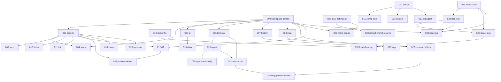

# Issues

[usagi.ai](https://github.com/KKyosuke/usagi.ai) の設計・機能を本プロジェクトへ移植するための対応 issue 一覧です。
各 issue は `NNN-feature.md` 形式で、上部にメタデータ（`status` / `priority` / `dependson` など）、その下に概要を記述しています。

## 凡例

- **status**: `todo` / `in-progress` / `done`（一覧では完了 issue を ✅ で示す）
- **priority**: `high` / `medium` / `low`
- **dependson**: 先に完了している必要がある issue 番号

## 一覧

| # | feature | 概要 | category | priority | dependson |
|---|---|---|---|---|---|
| 001 | [init-cli](001-init-cli.md) ✅ | `usagi init` / `usagi init --git <URL>` CLI コマンド | cli | high | — |
| 002 | [workspace-screen](002-workspace-screen.md) ✅ | ワークスペース画面とコマンドモード基盤 | tui | high | — |
| 003 | [session](003-session.md) ✅ | `session` セッション管理（`.usagi/sessions` 配下に再帰的に worktree 構築） | tui | high | 002 |
| 004 | [space](004-space.md) ✅ | `session switch` セッション切り替え | tui | high | 002, 003 |
| 005 | [ai](005-ai.md) | `ai` AI エージェントへの指示・対話 | tui | high | 002 |
| 006 | [terminal](006-terminal.md) ✅ | `terminal` 対話型ターミナル | tui | medium | 002, 003 |
| 007 | [history](007-history.md) | `history` コマンド履歴表示 | tui | medium | 002 |
| 008 | [man](008-man.md) ✅ | `man` ヘルプ表示 | tui | low | 002 |
| 009 | [sync](009-sync.md) | `usagi sync` main の変更を同期 | cli | medium | 003 |
| 010 | [finish](010-finish.md) | `usagi finish` セッション統合・削除 | cli | high | 003 |
| 011 | [list](011-list.md) | `usagi list` 全セッション俯瞰 | cli | medium | 003 |
| 012 | [diff](012-diff.md) | TUI Diff ビューア | tui | medium | 002, 003 |
| 013 | [logs](013-logs.md) | `usagi logs` 履歴の閲覧・検索 | cli | low | 007 |
| 014 | [clean](014-clean.md) | `usagi clean` 古いセッション整理 | cli | low | 003 |
| 015 | [config-edit](015-config-edit.md) ✅ | `usagi config --edit` 設定編集 | cli | medium | 001 |
| 016 | [context](016-context.md) | `usagi context` AI 用コンテキスト生成 | cli | low | 001 |
| 017 | [init-agent](017-init-agent.md) | `usagi init-agent` エージェント設定生成 | cli | low | 001 |
| 018 | [alias](018-alias.md) | `usagi alias` コマンドエイリアス | cli | low | 005 |
| 019 | [doctor-fix](019-doctor-fix.md) ✅ | `usagi doctor --fix` 依存自動修復 | cli | medium | — |
| 020 | [gh-issue](020-gh-issue.md) | gh Issue 連携セッション作成 | cli | low | 003 |
| 021 | [local-settings](021-local-settings.md) ✅ | プロジェクト単位のローカル設定（設定上書き） | core | medium | — |
| 022 | [local-settings-ui](022-local-settings-ui.md) ✅ | ローカル設定の編集 UI | tui | medium | 021 |
| 023 | [issue-store](023-issue-store.md) ✅ | issue ストア（`.usagi/issues/` への永続化と採番） | core | high | — |
| 024 | [issue-cli](024-issue-cli.md) ✅ | `usagi issue` サブコマンド（CRUD・検索） | cli | high | 023 |
| 025 | [issue-mcp](025-issue-mcp.md) ✅ | `usagi mcp` で issue 操作を LLM に公開 | mcp | high | 023, 024 |
| 026 | [agent](026-agent.md) ✅ | `agent` 埋め込みターミナルで Agent CLI を起動（`terminal` → `claude` のショートカット） | tui | medium | 006 |
| 027 | [command-hints](027-command-hints.md) ✅ | コマンドモードの入力候補・ヒント表示 | tui | low | 002, 008 |
| 028 | [agent-wait-notify](028-agent-wait-notify.md) ✅ | 埋め込みターミナルの入力待ち検知と通知（サイドバーマーカー＋デスクトップ通知） | tui | medium | 006, 026 |
| 029 | [home-config](029-home-config.md) ✅ | `config` ホーム画面から設定画面を開く | tui | medium | 002, 022 |
| 030 | [default-branch-source](030-default-branch-source.md) ✅ | セッション開始時のデフォルトブランチ基点（local / remote）をローカル設定で選択 | tui | medium | 022 |
| 031 | [root-mode](031-root-mode.md) ✅ | ルートモード（どのセッションにも属さず `terminal` / `agent` をワークスペースルートで起動） | tui | medium | 006, 026 |
| 032 | [local-llm-mcp](032-local-llm-mcp.md) ✅ | ローカル LLM を MCP 公開しクラウド Agent のトークン消費を抑制（config 有効化・未導入時 install） | mcp | medium | 019, 025 |
| 033 | [preview-viewer](033-preview-viewer.md) | 右ペイン統合プレビュー（diff / Markdown / ファイルのレンダリング表示） | tui | medium | 002, 003, 012 |
| 034 | [issue-tui](034-issue-tui.md) | TUI `issue` コマンド（関連性テーブル・進捗の可視化） | tui | medium | 002, 023, 024 |
| 035 | [engagement-ladder](035-engagement-ladder.md) ✅ | ホーム画面を 4 モード（統括・切替・在席・没入）の状態機械に再構成（`Ctrl-O` ズームアウト／スコープ物理分離／`session_action_ui` 追加） | tui | medium | 027, 031 |

## 依存関係

## 推奨着手順

1. **基盤**: 001 init-cli / 002 workspace-screen / 019 doctor-fix（依存なし、並行可能）
2. **セッション中核**: 003 session → 004 space / 010 finish / 011 list
3. **作業支援**: 005 ai / 006 terminal → 026 agent → 028 agent-wait-notify / 007 history / 008 man → 027 command-hints / 012 diff → 033 preview-viewer
4. **後続・拡張**: 009 sync / 013 logs / 014 clean / 015〜018 / 020
5. **issue 管理（タスク管理）**: 023 issue-store → 024 issue-cli → 025 issue-mcp → 034 issue-tui
6. **拡張（トークン最適化）**: 019 doctor-fix / 025 issue-mcp → 032 local-llm-mcp

> [!NOTE]
> 本一覧は `usagi.ai` の `issue/` および `doc/` を参照して作成しています。実装済みの機能（`doctor` / `hop` / `status`、Welcome/Home/New/Open/Config 画面、通知）は対象外です。
